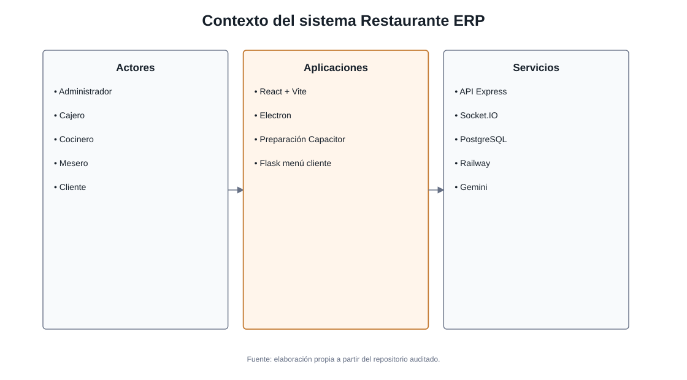
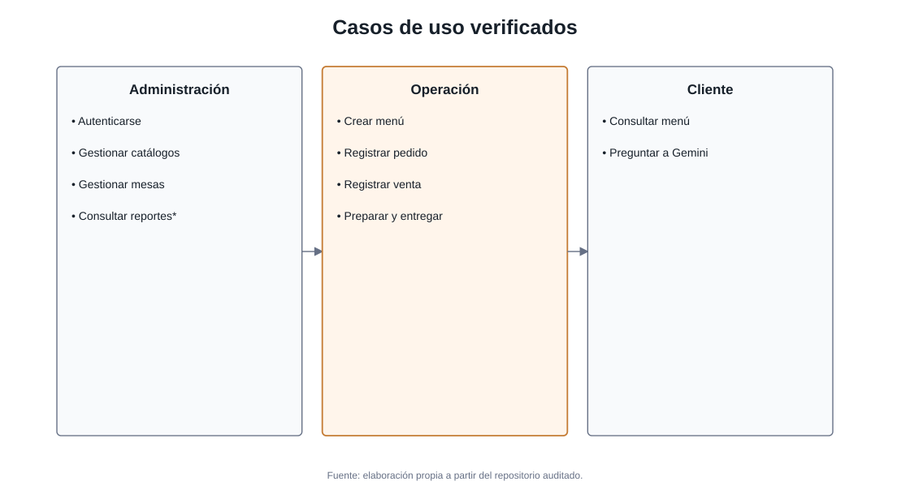
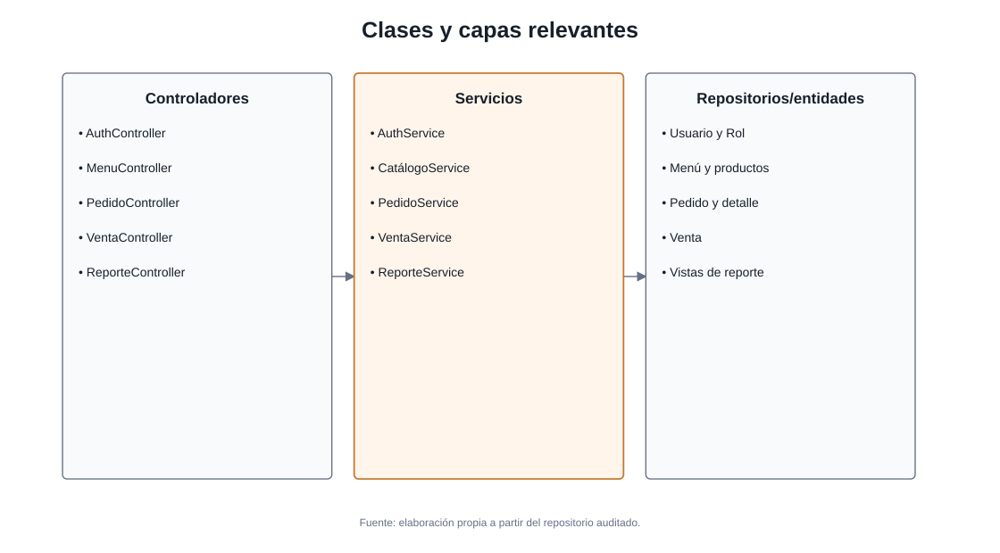
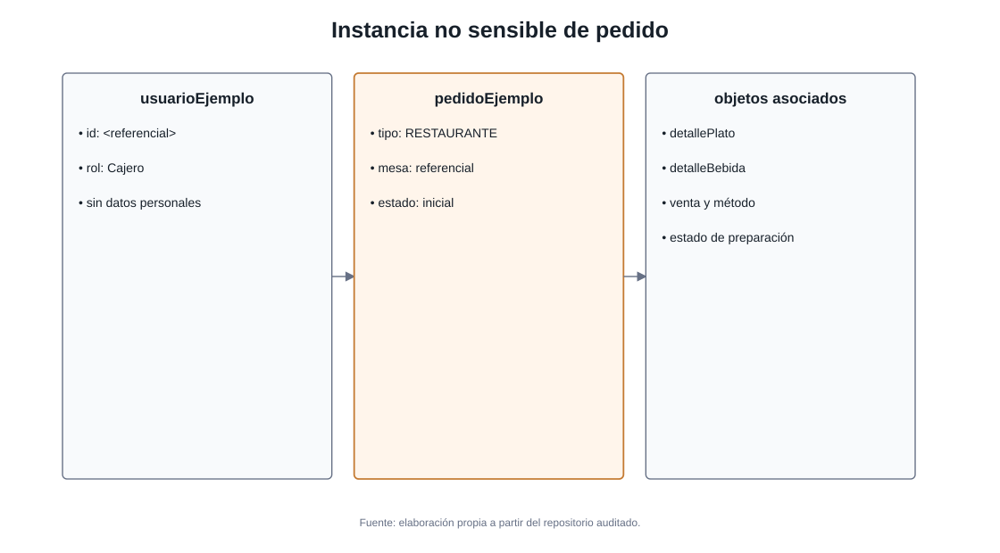
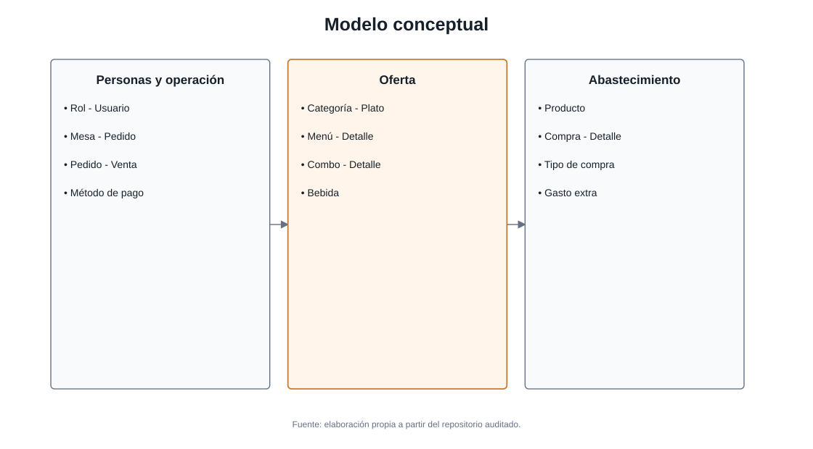
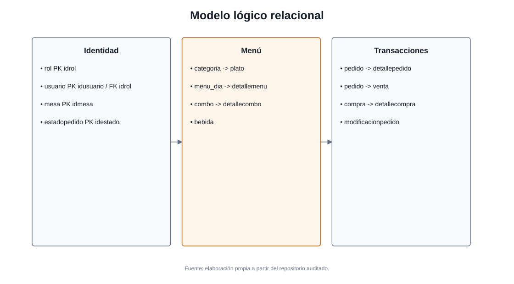
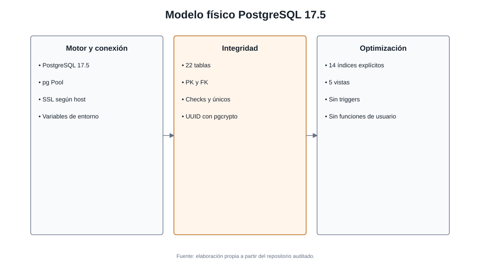
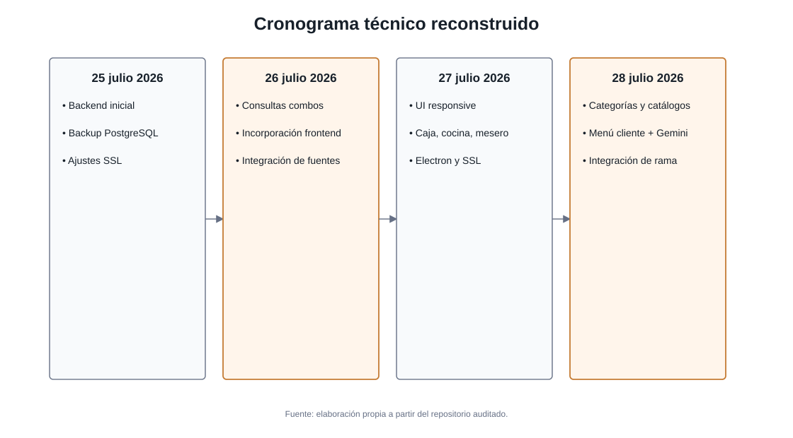

# INFORME DEL PROYECTO DE DESARROLLO DE SOFTWARE

<strong>Institución:</strong> [PENDIENTE DE INFORMACIÓN DEL EQUIPO]

<strong>Carrera:</strong> [PENDIENTE DE INFORMACIÓN DEL EQUIPO]

<strong>Asignatura:</strong> [PENDIENTE DE INFORMACIÓN DEL EQUIPO]

<h1>Informe del Proyecto de Desarrollo de Software</h1>
<h2>Restaurante ERP</h2>

<strong>Integrantes:</strong> [PENDIENTE DE INFORMACIÓN DEL EQUIPO]

<strong>Docente:</strong> [PENDIENTE DE INFORMACIÓN DEL EQUIPO]

<strong>Ciudad y país:</strong> [PENDIENTE DE INFORMACIÓN DEL EQUIPO]

<strong>Gestión:</strong> 2026

## Revisión histórica

**Tabla 1. Revisión histórica del documento**

| Versión | Fecha | Autor | Descripción del cambio |
| --- | --- | --- | --- |
| 1.0 | 29/07/2026 | Equipo de desarrollo, pendiente de validación | Elaboración inicial del informe técnico. |

## Control de la auditoría

**Tabla 2. Identificación de la línea base auditada**

| Elemento | Valor |
| --- | --- |
| Rama | feature/diseno-responsive |
| Commit | 1546004b5a4ab217ab2b64481e8bc96766f702d3 |
| Fecha y hora de auditoría | 29 de julio de 2026, 00:27 (UTC-4) |
| Estado inicial del árbol | Limpio; antes de generar este informe, git status --short no mostró cambios. |
| Estado posterior esperado | Únicamente docs/informe-final/ como contenido nuevo no rastreado. |
| Método | Lectura de código, configuración, SQL, interfaces, historial Git y dos documentos PDF de referencia. |

El análisis fue estático y local. No se usaron credenciales, no se consultó la base remota, no se invocó Gemini, no se escribieron datos externos y no se realizaron pruebas de aceptación con usuarios. La condición operativa de Railway, PostgreSQL/Supabase y Gemini queda pendiente de validación con un entorno autorizado.

## Tabla de contenidos

- FASE I: FUNDAMENTOS Y ALCANCE
  - 1. Introducción y Objetivos
  - 2. Toma de Requerimientos
- FASE II: ESPECIFICACIÓN FUNCIONAL
  - 3. Requerimientos del Software
  - 4. Modelado de Negocio y Casos de Uso
- FASE III: DISEÑO DE LA SOLUCIÓN
  - 5. Modelado de Objetos y Clases
  - 6. Diseño de Base de Datos
- FASE IV: GESTIÓN ÁGIL DEL PROYECTO
  - 7. Estructura de Roles y Equipo
  - 8. Artefactos de Scrum
  - 9. Ceremonias y Seguimiento
- FASE V: PLANIFICACIÓN Y CONTROL
  - 10. Planificación Temporal
  - 11. Gestión de Riesgos y Contingencias
- FASE VI: ANEXOS Y CIERRE
  - 12. Anexos

## Lista de figuras

- Figura 1. Diagrama de contexto del sistema
- Figura 2. Diagrama general de casos de uso
- Figura 3. Diagrama de clases
- Figura 4. Diagrama de objetos
- Figura 5. Modelo conceptual de base de datos
- Figura 6. Modelo lógico de base de datos
- Figura 7. Modelo físico de base de datos
- Figura 8. Cronograma reconstruido a partir de Git
- Figura 9. Pantalla de inicio
- Figura 10. Inicio de sesión
- Figura 11. Panel administrativo
- Figura 12. Gestión de categorías
- Figura 13. Gestión de platos
- Figura 14. Gestión de bebidas
- Figura 15. Gestión de combos
- Figura 16. Gestión de mesas
- Figura 17. Caja y registro de pedido
- Figura 18. Panel de cocina
- Figura 19. Panel del mesero
- Figura 20. Menú cliente

## Lista de tablas

- Tabla 1. Revisión histórica del documento
- Tabla 2. Identificación de la línea base auditada
- Tabla 3. Alcance funcional
- Tabla 4. Actores y clases de usuario
- Tabla 5. Glosario y acrónimos
- Tabla 6. RF-AUT-001: Iniciar sesión
- Tabla 7. RF-AUT-002: Consultar perfil autenticado
- Tabla 8. RF-AUT-003: Listar cuentas
- Tabla 9. RF-ADM-001: Seleccionar área
- Tabla 10. RF-ADM-002: Navegar por administración
- Tabla 11. RF-CAT-001: Listar categorías
- Tabla 12. RF-CAT-002: Consultar categoría
- Tabla 13. RF-CAT-003: Crear categoría
- Tabla 14. RF-CAT-004: Actualizar categoría
- Tabla 15. RF-CAT-005: Eliminar categoría
- Tabla 16. RF-PLA-001: Listar platos
- Tabla 17. RF-PLA-002: Consultar plato
- Tabla 18. RF-PLA-003: Crear plato
- Tabla 19. RF-PLA-004: Actualizar plato
- Tabla 20. RF-PLA-005: Eliminar plato
- Tabla 21. RF-BEB-001: Listar bebidas
- Tabla 22. RF-BEB-002: Consultar bebida
- Tabla 23. RF-BEB-003: Crear bebida
- Tabla 24. RF-BEB-004: Actualizar bebida
- Tabla 25. RF-BEB-005: Eliminar bebida
- Tabla 26. RF-MES-001: Listar mesas
- Tabla 27. RF-MES-002: Consultar mesa
- Tabla 28. RF-MES-003: Crear mesa
- Tabla 29. RF-MES-004: Actualizar mesa
- Tabla 30. RF-MES-005: Eliminar mesa
- Tabla 31. RF-COM-001: Listar combos
- Tabla 32. RF-COM-002: Consultar detalle de combo
- Tabla 33. RF-COM-003: Crear combo
- Tabla 34. RF-MEN-001: Listar menús
- Tabla 35. RF-MEN-002: Consultar menú activo
- Tabla 36. RF-MEN-003: Crear menú del día
- Tabla 37. RF-MEN-004: Agregar platos al menú
- Tabla 38. RF-MEN-005: Cerrar menú
- Tabla 39. RF-MEN-006: Actualizar stock de detalle
- Tabla 40. RF-MEN-007: Desactivar detalle de menú
- Tabla 41. RF-PED-001: Registrar pedido
- Tabla 42. RF-PED-002: Listar pedidos
- Tabla 43. RF-PED-003: Consultar pedido
- Tabla 44. RF-PED-004: Emitir novedad de pedido
- Tabla 45. RF-CAJ-001: Construir pedido
- Tabla 46. RF-CAJ-002: Coordinar pedido y venta
- Tabla 47. RF-VEN-001: Registrar venta
- Tabla 48. RF-VEN-002: Emitir venta realizada
- Tabla 49. RF-COC-001: Consultar pendientes de cocina
- Tabla 50. RF-COC-002: Iniciar preparación
- Tabla 51. RF-COC-003: Marcar plato listo
- Tabla 52. RF-MSR-001: Consultar platos listos
- Tabla 53. RF-MSR-002: Entregar pedido
- Tabla 54. RF-REP-001: Consultar reportes
- Tabla 55. RF-REP-002: Exportar reportes
- Tabla 56. RF-CLI-001: Consultar menú público
- Tabla 57. RF-CLI-002: Tolerar ausencia del catálogo
- Tabla 58. RF-IA-001: Responder consulta con Gemini
- Tabla 59. RF-ESC-001: Ejecutar en Electron
- Tabla 60. RF-ESC-002: Persistir sesión local
- Tabla 61. Interfaces externas
- Tabla 62. Endpoints HTTP de la API
- Tabla 63. Interfaces de usuario
- Tabla 64. RNF-SEG-001: Seguridad
- Tabla 65. RNF-REN-001: Rendimiento
- Tabla 66. RNF-USA-001: Usabilidad
- Tabla 67. RNF-ACC-001: Accesibilidad
- Tabla 68. RNF-FIA-001: Fiabilidad
- Tabla 69. RNF-ESC-001: Escalabilidad y disponibilidad
- Tabla 70. RNF-MAN-001: Mantenibilidad
- Tabla 71. RNF-POR-001: Portabilidad
- Tabla 72. RNF-COM-001: Compatibilidad y conectividad
- Tabla 73. RNF-DAT-001: Integridad de datos
- Tabla 74. CU-001: Iniciar sesión
- Tabla 75. CU-002: Gestionar categorías
- Tabla 76. CU-003: Gestionar platos
- Tabla 77. CU-004: Gestionar bebidas
- Tabla 78. CU-005: Gestionar combos
- Tabla 79. CU-006: Gestionar mesas
- Tabla 80. CU-007: Crear menú del día
- Tabla 81. CU-008: Registrar pedido
- Tabla 82. CU-009: Registrar venta
- Tabla 83. CU-010: Actualizar pedido en cocina
- Tabla 84. CU-011: Entregar pedido
- Tabla 85. CU-012: Consultar reportes
- Tabla 86. CU-013: Consultar menú cliente
- Tabla 87. CU-014: Usar Gemini
- Tabla 88. Matriz de trazabilidad funcional
- Tabla 89. Relaciones principales
- Tabla 90. Inventario físico
- Tabla 91. Roles Scrum
- Tabla 92. Matriz RACI editable
- Tabla 93. Product Backlog reconstruido
- Tabla 94. Sprint Backlog reconstruido
- Tabla 95. Metas reconstruidas
- Tabla 96. Formato editable de Sprint Planning
- Tabla 97. Formato editable de Daily Scrum
- Tabla 98. Formato editable de Sprint Review
- Tabla 99. Formato editable de Sprint Retrospective
- Tabla 100. Matriz de contingencia
- Tabla 101. Diccionario de datos: bebida
- Tabla 102. Diccionario de datos: categoria
- Tabla 103. Diccionario de datos: combo
- Tabla 104. Diccionario de datos: compra
- Tabla 105. Diccionario de datos: configuracionrestaurante
- Tabla 106. Diccionario de datos: detallecombo
- Tabla 107. Diccionario de datos: detallecompra
- Tabla 108. Diccionario de datos: detallemenu
- Tabla 109. Diccionario de datos: detallepedido
- Tabla 110. Diccionario de datos: estadopedido
- Tabla 111. Diccionario de datos: gastoextra
- Tabla 112. Diccionario de datos: menu_dia
- Tabla 113. Diccionario de datos: mesa
- Tabla 114. Diccionario de datos: metodopago
- Tabla 115. Diccionario de datos: modificacionpedido
- Tabla 116. Diccionario de datos: pedido
- Tabla 117. Diccionario de datos: plato
- Tabla 118. Diccionario de datos: producto
- Tabla 119. Diccionario de datos: rol
- Tabla 120. Diccionario de datos: tipocompra
- Tabla 121. Diccionario de datos: usuario
- Tabla 122. Diccionario de datos: venta
- Tabla 123. Plantilla de acta de aceptación

# FASE I: FUNDAMENTOS Y ALCANCE

## 1. Introducción y Objetivos

### 1.1. Propósito del Documento

El propósito de este informe es consolidar la especificación, el diseño, la trazabilidad y la evidencia técnica del sistema Restaurante ERP. Está dirigido al docente, al equipo de desarrollo, a evaluadores, mantenedores y usuarios responsables. Su uso esperado es apoyar revisión académica, validación funcional, mantenimiento y planificación de mejoras.

La especificación se reconstruyó a partir del repositorio en la línea base indicada. El contenido sigue el formato de especificación de requerimientos aportado y el índice detallado del proyecto, integrando propósito, alcance, perspectiva, actores, restricciones, requisitos, interfaces y modelos sin atribuir al equipo actividades no documentadas.

### 1.2. Alcance del Proyecto

El nombre verificable del producto de escritorio es **Restaurante ERP**, presente en `restaurante-desktop/package.json` y en la interfaz. El sistema atiende la administración de catálogos de restaurante y el flujo operativo de menú del día, pedido, venta, preparación y entrega. La solución incluye una API Express, una base PostgreSQL, una interfaz React adaptable con empaquetado Electron, preparación Capacitor y un menú público Flask con integración Gemini.

**Tabla 3. Alcance funcional**

| Área | Incluido | No incluido | Evidencia |
| --- | --- | --- | --- |
| Autenticación | Login bcrypt/JWT, perfil y sesión local | Recuperación de contraseña, MFA y autorización integral por rol | backend/src/modules/auth; AuthContext.jsx |
| Administración | Categorías, platos, bebidas, combos y mesas | Compras, productos, usuarios y configuración, aunque existen tablas | AppRouter.jsx; páginas Admin; restaurante.sql |
| Operación | Menú del día, pedido, venta, cocina y entrega | Facturación fiscal, devolución y cierre de caja | páginas Caja/Cocina/Mesero; módulos backend |
| Reportes | Cinco consultas y cinco exportaciones XLSX en backend | Visualización integrada en React | backend/src/modules/reporte; Admin/Reportes.jsx |
| Cliente | Catálogo público y consulta Gemini | Pedido en línea y pago del cliente | menu-cliente/app.py |
| Plataformas | Web Vite y Electron configurado | Proyecto nativo Android/iOS y firma de instalador | electron/main.cjs; capacitor.config.json |

#### Perspectiva del producto e interfaces

La interfaz React usa `HashRouter`, lo que evita dependencia de reescrituras del servidor y es compatible con el archivo local de Electron. Axios consume por HTTPS una URL Railway hardcodeada. La API Express intercambia JSON, usa CORS, Helmet y Morgan y accede a PostgreSQL con `pg`. El pool activa SSL cuando el host no es `localhost`, con `rejectUnauthorized: false`. El repositorio no contiene SDK de Supabase ni una URL de Supabase; su utilización solo aparece referida por mensajes de commit y por compatibilidad PostgreSQL, por lo que su instancia efectiva queda **PENDIENTE DE VALIDACIÓN**.

Electron carga Vite en desarrollo y `dist/index.html` empaquetado, con `contextIsolation`, sandbox y navegación externa controlada. Capacitor contiene `appId`, nombre y `webDir`, pero no se encontraron proyectos nativos. Flask consume los catálogos de Railway y Gemini mediante `google.genai`. Socket.IO emite eventos de pedido y venta, pero la aplicación React no instala ni consume `socket.io-client`.

*Figura 1. Diagrama de contexto del sistema. Fuente: elaboración propia con evidencia del repositorio.*

#### Restricciones, supuestos y dependencias

- Requiere conectividad para API Railway, base remota y Gemini; el frontend no implementa modo sin conexión.
- La API base está fija en dos fuentes y no se parametriza por entorno.
- La instancia y credenciales de PostgreSQL se reciben por variables de entorno; no se reproducen valores.
- Gemini requiere `API_KEY`; la disponibilidad y cuota no fueron verificadas.
- La operación presupone IDs de estados 1, 3 y 4 y método de pago inicial 1 en la interfaz; su significado depende de datos de referencia.
- No se verificó despliegue Android/iOS ni firma del instalador Windows.
- Las rutas frontend no tienen guard de sesión/rol y casi todos los endpoints de negocio carecen de middleware de autenticación.

### 1.3. Product Goal

Centralizar en Restaurante ERP la administración del menú y las mesas, y coordinar el registro de pedidos y ventas con la preparación en cocina y la entrega por mesero, mediante interfaces adaptables para los roles operativos verificados y un menú público conectado al catálogo real. La meta se limita al valor operativo demostrable; no presupone objetivos comerciales, métricas de ventas ni aceptación del cliente.

## 2. Toma de Requerimientos

### 2.1. Técnicas Utilizadas

No se encontró documentación formal de entrevistas o encuestas. Para la elaboración del presente informe se realizó una reconstrucción de requisitos mediante ingeniería inversa del código, análisis de la base de datos, revisión de interfaces y análisis del historial Git.

Sí existe evidencia de prototipado y evolución iterativa en los componentes y commits de interfaz entre el 27 y el 28 de julio de 2026. Esto demuestra iteración técnica, pero no permite afirmar que se aplicaron reuniones, observación presencial, encuestas o historias de usuario originales. Las actas y fuentes primarias de levantamiento quedan en el registro de pendientes.

### 2.2. Descripción de los Actores del Sistema

**Tabla 4. Actores y clases de usuario**

| Actor | Tipo | Responsabilidad | Funciones | Dispositivo | Evidencia |
| --- | --- | --- | --- | --- | --- |
| Administrador | Humano | Mantener catálogos y mesas; consultar reportes cuando exista interfaz | CRUD de categorías, platos, bebidas y mesas; crear combos | Escritorio/tablet | Home.jsx; AdminLayout.jsx; páginas Admin |
| Cajero/Cajera | Humano | Configurar menú, registrar pedido y venta | Menú del día, pedido, venta y combos | Escritorio/táctil | Home.jsx usa Cajera; backend/roles requiere validación |
| Cocinero/Cocinera | Humano | Gestionar preparación | Consultar pendientes y cambiar estados | Pantalla de cocina | Home.jsx usa Cocinera; Cocina.jsx |
| Mesero | Humano | Entregar productos listos | Consultar listos y marcar entrega | Móvil/tablet | Mesero.jsx |
| Cliente | Humano | Consultar oferta pública | Ver catálogos y preguntar al asistente | Navegador | menu-cliente |
| Servicio Gemini | Sistema externo | Generar respuesta a partir del prompt | generate_content | HTTPS externo | services/gemini.py |

La experiencia, nivel técnico, frecuencia de uso y necesidades específicas de cada actor no están documentadas formalmente: [PENDIENTE DE INFORMACIÓN DEL EQUIPO]. Por diseño, las interfaces internas priorizan operación repetida, ratón, teclado y controles táctiles; el mesero tiene composición móvil. Los valores de roles muestran variantes Cajera/Cajero y Cocinera/Cocinero que no se corrigieron y deben validarse contra los datos reales.

### 2.3. Glosario de Términos del Negocio

**Tabla 5. Glosario y acrónimos**

| Término/Acrónimo | Definición |
| --- | --- |
| ERP | Sistema integrado para procesos y datos operativos del restaurante. |
| POS | Punto de venta; flujo de captura de pedido y cobro. |
| API | Interfaz HTTP del backend Express bajo `/api`. |
| JWT | Token firmado usado para representar la sesión y perfil. |
| CRUD | Crear, consultar, actualizar y eliminar registros. |
| SRS | Especificación de requisitos de software. |
| Categoría | Clasificación de platos. |
| Plato | Producto preparado asociado a categoría y precio. |
| Bebida | Producto líquido con tipo, precio y existencias. |
| Combo | Agrupación de platos con cantidad y precio propio. |
| Mesa | Ubicación numerada con capacidad y disponibilidad. |
| Menú del día | Conjunto fechado y activo de platos con stock. |
| Pedido | Cabecera de consumo con tipo, usuario, mesa, estado y total. |
| Detalle | Línea individual asociada a menú, combo, compra o pedido. |
| Venta | Cobro asociado a pedido y método de pago. |
| Cocina | Área que cambia detalles desde pendiente hasta listo. |
| Mesero | Rol que registra la entrega de detalles listos. |
| Supabase | Servicio PostgreSQL citado en commits; instancia efectiva no verificable en archivos. |
| Railway | Plataforma del host hardcodeado de la API. |
| Electron | Contenedor de escritorio Windows configurado. |
| Capacitor | Contenedor móvil con configuración base, sin proyecto nativo verificado. |
| Gemini | Servicio de IA consumido por `google.genai`. |

#### Referencias documentales

- Formato de especificación de requerimientos de software (PDF aportado, 7 páginas).
- Índice detallado para proyecto de desarrollo de software (PDF aportado, 3 páginas).
- Repositorio local auditado en rama `feature/diseno-responsive`, commit `1546004b5a4ab217ab2b64481e8bc96766f702d3`.
- `database/restaurante.sql`, dump PostgreSQL 17.5.
- Manifiestos `backend/package.json`, `restaurante-desktop/package.json` y `menu-cliente/requirements.txt`.

# FASE II: ESPECIFICACIÓN FUNCIONAL

## 3. Requerimientos del Software

### 3.1. Requerimientos Funcionales

Se identificaron **55 requisitos funcionales**. Cada requisito es atómico, comienza con la fórmula obligatoria y se clasifica conforme a integración observable. “Implementado” no implica validación en producción.

#### RF-AUT-001. Iniciar sesión

**Tabla 6. RF-AUT-001: Iniciar sesión**

| Campo | Contenido |
| --- | --- |
| ID | RF-AUT-001 |
| Nombre | Iniciar sesión |
| Descripción | El sistema deberá autenticar un usuario mediante nombre de usuario y contraseña y devolver un JWT junto con su identidad y rol. |
| Actor | Operador |
| Entrada | username, password |
| Proceso | Iniciar sesión |
| Salida | token, usuario{id,codigo,username,rol} |
| Precondiciones | El servicio correspondiente está disponible y existen los datos de referencia requeridos. |
| Postcondiciones | La respuesta refleja el resultado de la operación solicitada. |
| Flujo alterno | La API propaga el error al manejador central; la interfaz muestra alerta, mensaje o estado vacío según la pantalla. |
| Validaciones | Verifica existencia del usuario y compara la contraseña con bcrypt. |
| Estado | IMPLEMENTADO |
| Evidencia | backend/src/modules/auth; restaurante-desktop/src/pages/Login/Login.jsx; POST /api/auth/login |
| Criterio de aceptación | Con credenciales válidas se obtiene token y usuario; con credenciales inválidas se responde con error sin exponer el hash. |

#### RF-AUT-002. Consultar perfil autenticado

**Tabla 7. RF-AUT-002: Consultar perfil autenticado**

| Campo | Contenido |
| --- | --- |
| ID | RF-AUT-002 |
| Nombre | Consultar perfil autenticado |
| Descripción | El sistema deberá validar un token Bearer antes de devolver el perfil contenido en el JWT. |
| Actor | Operador |
| Entrada | Authorization: Bearer <token> |
| Proceso | Consultar perfil autenticado |
| Salida | Payload JWT decodificado |
| Precondiciones | El servicio correspondiente está disponible y existen los datos de referencia requeridos. |
| Postcondiciones | La respuesta refleja el resultado de la operación solicitada. |
| Flujo alterno | La API propaga el error al manejador central; la interfaz muestra alerta, mensaje o estado vacío según la pantalla. |
| Validaciones | Requiere cabecera y firma JWT válidas. |
| Estado | IMPLEMENTADO |
| Evidencia | backend/src/modules/auth; restaurante-desktop/src/pages/Login/Login.jsx; GET /api/auth/profile |
| Criterio de aceptación | Al ejecutar consultar perfil autenticado, el resultado se refleja sin alterar el contrato documentado. |

#### RF-AUT-003. Listar cuentas

**Tabla 8. RF-AUT-003: Listar cuentas**

| Campo | Contenido |
| --- | --- |
| ID | RF-AUT-003 |
| Nombre | Listar cuentas |
| Descripción | El sistema deberá devolver el inventario de cuentas y roles disponible en el servidor. |
| Actor | Operador |
| Entrada | Sin cuerpo |
| Proceso | Listar cuentas |
| Salida | Lista de cuentas sin contraseña |
| Precondiciones | El servicio correspondiente está disponible y existen los datos de referencia requeridos. |
| Postcondiciones | La respuesta refleja el resultado de la operación solicitada. |
| Flujo alterno | La API propaga el error al manejador central; la interfaz muestra alerta, mensaje o estado vacío según la pantalla. |
| Validaciones | No tiene middleware de autenticación; constituye un riesgo de exposición. |
| Estado | SOLO BACKEND |
| Evidencia | backend/src/modules/auth; restaurante-desktop/src/pages/Login/Login.jsx; GET /api/auth/accounts |
| Criterio de aceptación | Al ejecutar listar cuentas, el resultado se refleja sin alterar el contrato documentado. |

#### RF-ADM-001. Seleccionar área

**Tabla 9. RF-ADM-001: Seleccionar área**

| Campo | Contenido |
| --- | --- |
| ID | RF-ADM-001 |
| Nombre | Seleccionar área |
| Descripción | El sistema deberá permitir seleccionar Administrador, Cajera, Cocinera o Mesero y navegar al login con el rol como parámetro. |
| Actor | Administrador |
| Entrada | Selección de tarjeta de rol |
| Proceso | Seleccionar área |
| Salida | Pantalla de login identificada por rol |
| Precondiciones | El servicio correspondiente está disponible y existen los datos de referencia requeridos. |
| Postcondiciones | La respuesta refleja el resultado de la operación solicitada. |
| Flujo alterno | La API propaga el error al manejador central; la interfaz muestra alerta, mensaje o estado vacío según la pantalla. |
| Validaciones | Usa valores literales existentes y botones semánticos. |
| Estado | IMPLEMENTADO |
| Evidencia | restaurante-desktop/src/routes/AppRouter.jsx; restaurante-desktop/src/layouts/AdminLayout.jsx; HashRouter /login/:rol |
| Criterio de aceptación | Al ejecutar seleccionar área, el resultado se refleja sin alterar el contrato documentado. |

#### RF-ADM-002. Navegar por administración

**Tabla 10. RF-ADM-002: Navegar por administración**

| Campo | Contenido |
| --- | --- |
| ID | RF-ADM-002 |
| Nombre | Navegar por administración |
| Descripción | El sistema deberá ofrecer al administrador acceso a categorías, platos, bebidas, combos, mesas y reportes. |
| Actor | Administrador |
| Entrada | Selección de navegación |
| Proceso | Navegar por administración |
| Salida | Pantalla administrativa solicitada |
| Precondiciones | El servicio correspondiente está disponible y existen los datos de referencia requeridos. |
| Postcondiciones | La respuesta refleja el resultado de la operación solicitada. |
| Flujo alterno | La API propaga el error al manejador central; la interfaz muestra alerta, mensaje o estado vacío según la pantalla. |
| Validaciones | Las rutas existen; no hay guard de autorización en el router. |
| Estado | IMPLEMENTADO |
| Evidencia | restaurante-desktop/src/routes/AppRouter.jsx; restaurante-desktop/src/layouts/AdminLayout.jsx; Rutas #/admin/* |
| Criterio de aceptación | Al ejecutar navegar por administración, el resultado se refleja sin alterar el contrato documentado. |

#### RF-CAT-001. Listar categorías

**Tabla 11. RF-CAT-001: Listar categorías**

| Campo | Contenido |
| --- | --- |
| ID | RF-CAT-001 |
| Nombre | Listar categorías |
| Descripción | El sistema deberá consultar y presentar las categorías activas registradas. |
| Actor | Administrador |
| Entrada | Sin cuerpo |
| Proceso | Listar categorías |
| Salida | Colección de categorías |
| Precondiciones | El servicio correspondiente está disponible y existen los datos de referencia requeridos. |
| Postcondiciones | La respuesta refleja el resultado de la operación solicitada. |
| Flujo alterno | La API propaga el error al manejador central; la interfaz muestra alerta, mensaje o estado vacío según la pantalla. |
| Validaciones | La interfaz contempla carga, error y ausencia de datos. |
| Estado | IMPLEMENTADO |
| Evidencia | backend/src/modules/menu/categorias; restaurante-desktop/src/pages/Admin/Categorias.jsx; GET /api/menu/categorias |
| Criterio de aceptación | Al ejecutar listar categorías, el resultado se refleja sin alterar el contrato documentado. |

#### RF-CAT-002. Consultar categoría

**Tabla 12. RF-CAT-002: Consultar categoría**

| Campo | Contenido |
| --- | --- |
| ID | RF-CAT-002 |
| Nombre | Consultar categoría |
| Descripción | El sistema deberá consultar una categoría por su identificador. |
| Actor | Administrador |
| Entrada | Identificador de ruta |
| Proceso | Consultar categoría |
| Salida | Detalle de categoría |
| Precondiciones | El servicio correspondiente está disponible y existen los datos de referencia requeridos. |
| Postcondiciones | La respuesta refleja el resultado de la operación solicitada. |
| Flujo alterno | La API propaga el error al manejador central; la interfaz muestra alerta, mensaje o estado vacío según la pantalla. |
| Validaciones | El servicio devuelve no encontrado cuando no existe. |
| Estado | SOLO BACKEND |
| Evidencia | backend/src/modules/menu/categorias; restaurante-desktop/src/pages/Admin/Categorias.jsx; GET /api/menu/categorias/:id |
| Criterio de aceptación | Al ejecutar consultar categoría, el resultado se refleja sin alterar el contrato documentado. |

#### RF-CAT-003. Crear categoría

**Tabla 13. RF-CAT-003: Crear categoría**

| Campo | Contenido |
| --- | --- |
| ID | RF-CAT-003 |
| Nombre | Crear categoría |
| Descripción | El sistema deberá registrar una categoría con los campos definidos por su contrato. |
| Actor | Administrador |
| Entrada | Datos de categoría |
| Proceso | Crear categoría |
| Salida | categoría creada |
| Precondiciones | El servicio correspondiente está disponible y existen los datos de referencia requeridos. |
| Postcondiciones | La respuesta refleja el resultado de la operación solicitada. |
| Flujo alterno | La API propaga el error al manejador central; la interfaz muestra alerta, mensaje o estado vacío según la pantalla. |
| Validaciones | Nombre obligatorio. |
| Estado | IMPLEMENTADO |
| Evidencia | backend/src/modules/menu/categorias; restaurante-desktop/src/pages/Admin/Categorias.jsx; POST /api/menu/categorias |
| Criterio de aceptación | Al ejecutar crear categoría, el resultado se refleja sin alterar el contrato documentado. |

#### RF-CAT-004. Actualizar categoría

**Tabla 14. RF-CAT-004: Actualizar categoría**

| Campo | Contenido |
| --- | --- |
| ID | RF-CAT-004 |
| Nombre | Actualizar categoría |
| Descripción | El sistema deberá actualizar una categoría existente sin cambiar su identificador. |
| Actor | Administrador |
| Entrada | Identificador y datos de categoría |
| Proceso | Actualizar categoría |
| Salida | categoría actualizada |
| Precondiciones | El servicio correspondiente está disponible y existen los datos de referencia requeridos. |
| Postcondiciones | La respuesta refleja el resultado de la operación solicitada. |
| Flujo alterno | La API propaga el error al manejador central; la interfaz muestra alerta, mensaje o estado vacío según la pantalla. |
| Validaciones | Comprueba existencia antes de actualizar; constraints de base preservan integridad. |
| Estado | IMPLEMENTADO |
| Evidencia | backend/src/modules/menu/categorias; restaurante-desktop/src/pages/Admin/Categorias.jsx; PUT /api/menu/categorias/:id |
| Criterio de aceptación | Al ejecutar actualizar categoría, el resultado se refleja sin alterar el contrato documentado. |

#### RF-CAT-005. Eliminar categoría

**Tabla 15. RF-CAT-005: Eliminar categoría**

| Campo | Contenido |
| --- | --- |
| ID | RF-CAT-005 |
| Nombre | Eliminar categoría |
| Descripción | El sistema deberá desactivar o retirar una categoría existente mediante su identificador. |
| Actor | Administrador |
| Entrada | Identificador |
| Proceso | Eliminar categoría |
| Salida | Confirmación de eliminación |
| Precondiciones | El servicio correspondiente está disponible y existen los datos de referencia requeridos. |
| Postcondiciones | La respuesta refleja el resultado de la operación solicitada. |
| Flujo alterno | La API propaga el error al manejador central; la interfaz muestra alerta, mensaje o estado vacío según la pantalla. |
| Validaciones | Comprueba existencia; los repositorios aplican eliminación lógica cuando corresponde. |
| Estado | IMPLEMENTADO |
| Evidencia | backend/src/modules/menu/categorias; restaurante-desktop/src/pages/Admin/Categorias.jsx; DELETE /api/menu/categorias/:id |
| Criterio de aceptación | Al ejecutar eliminar categoría, el resultado se refleja sin alterar el contrato documentado. |

#### RF-PLA-001. Listar platos

**Tabla 16. RF-PLA-001: Listar platos**

| Campo | Contenido |
| --- | --- |
| ID | RF-PLA-001 |
| Nombre | Listar platos |
| Descripción | El sistema deberá consultar y presentar las platos activas registradas. |
| Actor | Administrador |
| Entrada | Sin cuerpo |
| Proceso | Listar platos |
| Salida | Colección de platos |
| Precondiciones | El servicio correspondiente está disponible y existen los datos de referencia requeridos. |
| Postcondiciones | La respuesta refleja el resultado de la operación solicitada. |
| Flujo alterno | La API propaga el error al manejador central; la interfaz muestra alerta, mensaje o estado vacío según la pantalla. |
| Validaciones | La interfaz contempla carga, error y ausencia de datos. |
| Estado | IMPLEMENTADO |
| Evidencia | backend/src/modules/menu/platos; restaurante-desktop/src/pages/Admin/Platos.jsx; GET /api/menu/platos |
| Criterio de aceptación | Al ejecutar listar platos, el resultado se refleja sin alterar el contrato documentado. |

#### RF-PLA-002. Consultar plato

**Tabla 17. RF-PLA-002: Consultar plato**

| Campo | Contenido |
| --- | --- |
| ID | RF-PLA-002 |
| Nombre | Consultar plato |
| Descripción | El sistema deberá consultar una plato por su identificador. |
| Actor | Administrador |
| Entrada | Identificador de ruta |
| Proceso | Consultar plato |
| Salida | Detalle de plato |
| Precondiciones | El servicio correspondiente está disponible y existen los datos de referencia requeridos. |
| Postcondiciones | La respuesta refleja el resultado de la operación solicitada. |
| Flujo alterno | La API propaga el error al manejador central; la interfaz muestra alerta, mensaje o estado vacío según la pantalla. |
| Validaciones | El servicio devuelve no encontrado cuando no existe. |
| Estado | SOLO BACKEND |
| Evidencia | backend/src/modules/menu/platos; restaurante-desktop/src/pages/Admin/Platos.jsx; GET /api/menu/platos/:id |
| Criterio de aceptación | Al ejecutar consultar plato, el resultado se refleja sin alterar el contrato documentado. |

#### RF-PLA-003. Crear plato

**Tabla 18. RF-PLA-003: Crear plato**

| Campo | Contenido |
| --- | --- |
| ID | RF-PLA-003 |
| Nombre | Crear plato |
| Descripción | El sistema deberá registrar una plato con los campos definidos por su contrato. |
| Actor | Administrador |
| Entrada | Datos de plato |
| Proceso | Crear plato |
| Salida | plato creada |
| Precondiciones | El servicio correspondiente está disponible y existen los datos de referencia requeridos. |
| Postcondiciones | La respuesta refleja el resultado de la operación solicitada. |
| Flujo alterno | La API propaga el error al manejador central; la interfaz muestra alerta, mensaje o estado vacío según la pantalla. |
| Validaciones | La base exige precio no negativo; el servicio comprueba campos principales. |
| Estado | IMPLEMENTADO |
| Evidencia | backend/src/modules/menu/platos; restaurante-desktop/src/pages/Admin/Platos.jsx; POST /api/menu/platos |
| Criterio de aceptación | Al ejecutar crear plato, el resultado se refleja sin alterar el contrato documentado. |

#### RF-PLA-004. Actualizar plato

**Tabla 19. RF-PLA-004: Actualizar plato**

| Campo | Contenido |
| --- | --- |
| ID | RF-PLA-004 |
| Nombre | Actualizar plato |
| Descripción | El sistema deberá actualizar una plato existente sin cambiar su identificador. |
| Actor | Administrador |
| Entrada | Identificador y datos de plato |
| Proceso | Actualizar plato |
| Salida | plato actualizada |
| Precondiciones | El servicio correspondiente está disponible y existen los datos de referencia requeridos. |
| Postcondiciones | La respuesta refleja el resultado de la operación solicitada. |
| Flujo alterno | La API propaga el error al manejador central; la interfaz muestra alerta, mensaje o estado vacío según la pantalla. |
| Validaciones | Comprueba existencia antes de actualizar; constraints de base preservan integridad. |
| Estado | IMPLEMENTADO |
| Evidencia | backend/src/modules/menu/platos; restaurante-desktop/src/pages/Admin/Platos.jsx; PUT /api/menu/platos/:id |
| Criterio de aceptación | Al ejecutar actualizar plato, el resultado se refleja sin alterar el contrato documentado. |

#### RF-PLA-005. Eliminar plato

**Tabla 20. RF-PLA-005: Eliminar plato**

| Campo | Contenido |
| --- | --- |
| ID | RF-PLA-005 |
| Nombre | Eliminar plato |
| Descripción | El sistema deberá desactivar o retirar una plato existente mediante su identificador. |
| Actor | Administrador |
| Entrada | Identificador |
| Proceso | Eliminar plato |
| Salida | Confirmación de eliminación |
| Precondiciones | El servicio correspondiente está disponible y existen los datos de referencia requeridos. |
| Postcondiciones | La respuesta refleja el resultado de la operación solicitada. |
| Flujo alterno | La API propaga el error al manejador central; la interfaz muestra alerta, mensaje o estado vacío según la pantalla. |
| Validaciones | Comprueba existencia; los repositorios aplican eliminación lógica cuando corresponde. |
| Estado | IMPLEMENTADO |
| Evidencia | backend/src/modules/menu/platos; restaurante-desktop/src/pages/Admin/Platos.jsx; DELETE /api/menu/platos/:id |
| Criterio de aceptación | Al ejecutar eliminar plato, el resultado se refleja sin alterar el contrato documentado. |

#### RF-BEB-001. Listar bebidas

**Tabla 21. RF-BEB-001: Listar bebidas**

| Campo | Contenido |
| --- | --- |
| ID | RF-BEB-001 |
| Nombre | Listar bebidas |
| Descripción | El sistema deberá consultar y presentar las bebidas activas registradas. |
| Actor | Administrador |
| Entrada | Sin cuerpo |
| Proceso | Listar bebidas |
| Salida | Colección de bebidas |
| Precondiciones | El servicio correspondiente está disponible y existen los datos de referencia requeridos. |
| Postcondiciones | La respuesta refleja el resultado de la operación solicitada. |
| Flujo alterno | La API propaga el error al manejador central; la interfaz muestra alerta, mensaje o estado vacío según la pantalla. |
| Validaciones | La interfaz contempla carga, error y ausencia de datos. |
| Estado | IMPLEMENTADO |
| Evidencia | backend/src/modules/menu/bebidas; restaurante-desktop/src/pages/Admin/Bebidas.jsx; GET /api/bebidas |
| Criterio de aceptación | Al ejecutar listar bebidas, el resultado se refleja sin alterar el contrato documentado. |

#### RF-BEB-002. Consultar bebida

**Tabla 22. RF-BEB-002: Consultar bebida**

| Campo | Contenido |
| --- | --- |
| ID | RF-BEB-002 |
| Nombre | Consultar bebida |
| Descripción | El sistema deberá consultar una bebida por su identificador. |
| Actor | Administrador |
| Entrada | Identificador de ruta |
| Proceso | Consultar bebida |
| Salida | Detalle de bebida |
| Precondiciones | El servicio correspondiente está disponible y existen los datos de referencia requeridos. |
| Postcondiciones | La respuesta refleja el resultado de la operación solicitada. |
| Flujo alterno | La API propaga el error al manejador central; la interfaz muestra alerta, mensaje o estado vacío según la pantalla. |
| Validaciones | El servicio devuelve no encontrado cuando no existe. |
| Estado | SOLO BACKEND |
| Evidencia | backend/src/modules/menu/bebidas; restaurante-desktop/src/pages/Admin/Bebidas.jsx; GET /api/bebidas/:id |
| Criterio de aceptación | Al ejecutar consultar bebida, el resultado se refleja sin alterar el contrato documentado. |

#### RF-BEB-003. Crear bebida

**Tabla 23. RF-BEB-003: Crear bebida**

| Campo | Contenido |
| --- | --- |
| ID | RF-BEB-003 |
| Nombre | Crear bebida |
| Descripción | El sistema deberá registrar una bebida con los campos definidos por su contrato. |
| Actor | Administrador |
| Entrada | Datos de bebida |
| Proceso | Crear bebida |
| Salida | bebida creada |
| Precondiciones | El servicio correspondiente está disponible y existen los datos de referencia requeridos. |
| Postcondiciones | La respuesta refleja el resultado de la operación solicitada. |
| Flujo alterno | La API propaga el error al manejador central; la interfaz muestra alerta, mensaje o estado vacío según la pantalla. |
| Validaciones | La base exige precio no negativo; el servicio comprueba campos principales. |
| Estado | IMPLEMENTADO |
| Evidencia | backend/src/modules/menu/bebidas; restaurante-desktop/src/pages/Admin/Bebidas.jsx; POST /api/bebidas |
| Criterio de aceptación | Al ejecutar crear bebida, el resultado se refleja sin alterar el contrato documentado. |

#### RF-BEB-004. Actualizar bebida

**Tabla 24. RF-BEB-004: Actualizar bebida**

| Campo | Contenido |
| --- | --- |
| ID | RF-BEB-004 |
| Nombre | Actualizar bebida |
| Descripción | El sistema deberá actualizar una bebida existente sin cambiar su identificador. |
| Actor | Administrador |
| Entrada | Identificador y datos de bebida |
| Proceso | Actualizar bebida |
| Salida | bebida actualizada |
| Precondiciones | El servicio correspondiente está disponible y existen los datos de referencia requeridos. |
| Postcondiciones | La respuesta refleja el resultado de la operación solicitada. |
| Flujo alterno | La API propaga el error al manejador central; la interfaz muestra alerta, mensaje o estado vacío según la pantalla. |
| Validaciones | Comprueba existencia antes de actualizar; constraints de base preservan integridad. |
| Estado | IMPLEMENTADO |
| Evidencia | backend/src/modules/menu/bebidas; restaurante-desktop/src/pages/Admin/Bebidas.jsx; PUT /api/bebidas/:id |
| Criterio de aceptación | Al ejecutar actualizar bebida, el resultado se refleja sin alterar el contrato documentado. |

#### RF-BEB-005. Eliminar bebida

**Tabla 25. RF-BEB-005: Eliminar bebida**

| Campo | Contenido |
| --- | --- |
| ID | RF-BEB-005 |
| Nombre | Eliminar bebida |
| Descripción | El sistema deberá desactivar o retirar una bebida existente mediante su identificador. |
| Actor | Administrador |
| Entrada | Identificador |
| Proceso | Eliminar bebida |
| Salida | Confirmación de eliminación |
| Precondiciones | El servicio correspondiente está disponible y existen los datos de referencia requeridos. |
| Postcondiciones | La respuesta refleja el resultado de la operación solicitada. |
| Flujo alterno | La API propaga el error al manejador central; la interfaz muestra alerta, mensaje o estado vacío según la pantalla. |
| Validaciones | Comprueba existencia; los repositorios aplican eliminación lógica cuando corresponde. |
| Estado | IMPLEMENTADO |
| Evidencia | backend/src/modules/menu/bebidas; restaurante-desktop/src/pages/Admin/Bebidas.jsx; DELETE /api/bebidas/:id |
| Criterio de aceptación | Al ejecutar eliminar bebida, el resultado se refleja sin alterar el contrato documentado. |

#### RF-MES-001. Listar mesas

**Tabla 26. RF-MES-001: Listar mesas**

| Campo | Contenido |
| --- | --- |
| ID | RF-MES-001 |
| Nombre | Listar mesas |
| Descripción | El sistema deberá consultar y presentar las mesas activas registradas. |
| Actor | Administrador |
| Entrada | Sin cuerpo |
| Proceso | Listar mesas |
| Salida | Colección de mesas |
| Precondiciones | El servicio correspondiente está disponible y existen los datos de referencia requeridos. |
| Postcondiciones | La respuesta refleja el resultado de la operación solicitada. |
| Flujo alterno | La API propaga el error al manejador central; la interfaz muestra alerta, mensaje o estado vacío según la pantalla. |
| Validaciones | La interfaz contempla carga, error y ausencia de datos. |
| Estado | IMPLEMENTADO |
| Evidencia | backend/src/modules/mesa; restaurante-desktop/src/pages/Admin/Mesas.jsx; GET /api/mesas |
| Criterio de aceptación | Al ejecutar listar mesas, el resultado se refleja sin alterar el contrato documentado. |

#### RF-MES-002. Consultar mesa

**Tabla 27. RF-MES-002: Consultar mesa**

| Campo | Contenido |
| --- | --- |
| ID | RF-MES-002 |
| Nombre | Consultar mesa |
| Descripción | El sistema deberá consultar una mesa por su identificador. |
| Actor | Administrador |
| Entrada | Identificador de ruta |
| Proceso | Consultar mesa |
| Salida | Detalle de mesa |
| Precondiciones | El servicio correspondiente está disponible y existen los datos de referencia requeridos. |
| Postcondiciones | La respuesta refleja el resultado de la operación solicitada. |
| Flujo alterno | La API propaga el error al manejador central; la interfaz muestra alerta, mensaje o estado vacío según la pantalla. |
| Validaciones | El servicio devuelve no encontrado cuando no existe. |
| Estado | SOLO BACKEND |
| Evidencia | backend/src/modules/mesa; restaurante-desktop/src/pages/Admin/Mesas.jsx; GET /api/mesas/:id |
| Criterio de aceptación | Al ejecutar consultar mesa, el resultado se refleja sin alterar el contrato documentado. |

#### RF-MES-003. Crear mesa

**Tabla 28. RF-MES-003: Crear mesa**

| Campo | Contenido |
| --- | --- |
| ID | RF-MES-003 |
| Nombre | Crear mesa |
| Descripción | El sistema deberá registrar una mesa con los campos definidos por su contrato. |
| Actor | Administrador |
| Entrada | Datos de mesa |
| Proceso | Crear mesa |
| Salida | mesa creada |
| Precondiciones | El servicio correspondiente está disponible y existen los datos de referencia requeridos. |
| Postcondiciones | La respuesta refleja el resultado de la operación solicitada. |
| Flujo alterno | La API propaga el error al manejador central; la interfaz muestra alerta, mensaje o estado vacío según la pantalla. |
| Validaciones | Número y capacidad; la base exige capacidad mayor que cero y número único. |
| Estado | IMPLEMENTADO |
| Evidencia | backend/src/modules/mesa; restaurante-desktop/src/pages/Admin/Mesas.jsx; POST /api/mesas |
| Criterio de aceptación | Al ejecutar crear mesa, el resultado se refleja sin alterar el contrato documentado. |

#### RF-MES-004. Actualizar mesa

**Tabla 29. RF-MES-004: Actualizar mesa**

| Campo | Contenido |
| --- | --- |
| ID | RF-MES-004 |
| Nombre | Actualizar mesa |
| Descripción | El sistema deberá actualizar una mesa existente sin cambiar su identificador. |
| Actor | Administrador |
| Entrada | Identificador y datos de mesa |
| Proceso | Actualizar mesa |
| Salida | mesa actualizada |
| Precondiciones | El servicio correspondiente está disponible y existen los datos de referencia requeridos. |
| Postcondiciones | La respuesta refleja el resultado de la operación solicitada. |
| Flujo alterno | La API propaga el error al manejador central; la interfaz muestra alerta, mensaje o estado vacío según la pantalla. |
| Validaciones | Comprueba existencia antes de actualizar; constraints de base preservan integridad. |
| Estado | IMPLEMENTADO |
| Evidencia | backend/src/modules/mesa; restaurante-desktop/src/pages/Admin/Mesas.jsx; PUT /api/mesas/:id |
| Criterio de aceptación | Al ejecutar actualizar mesa, el resultado se refleja sin alterar el contrato documentado. |

#### RF-MES-005. Eliminar mesa

**Tabla 30. RF-MES-005: Eliminar mesa**

| Campo | Contenido |
| --- | --- |
| ID | RF-MES-005 |
| Nombre | Eliminar mesa |
| Descripción | El sistema deberá desactivar o retirar una mesa existente mediante su identificador. |
| Actor | Administrador |
| Entrada | Identificador |
| Proceso | Eliminar mesa |
| Salida | Confirmación de eliminación |
| Precondiciones | El servicio correspondiente está disponible y existen los datos de referencia requeridos. |
| Postcondiciones | La respuesta refleja el resultado de la operación solicitada. |
| Flujo alterno | La API propaga el error al manejador central; la interfaz muestra alerta, mensaje o estado vacío según la pantalla. |
| Validaciones | Comprueba existencia; los repositorios aplican eliminación lógica cuando corresponde. |
| Estado | IMPLEMENTADO |
| Evidencia | backend/src/modules/mesa; restaurante-desktop/src/pages/Admin/Mesas.jsx; DELETE /api/mesas/:id |
| Criterio de aceptación | Al ejecutar eliminar mesa, el resultado se refleja sin alterar el contrato documentado. |

#### RF-COM-001. Listar combos

**Tabla 31. RF-COM-001: Listar combos**

| Campo | Contenido |
| --- | --- |
| ID | RF-COM-001 |
| Nombre | Listar combos |
| Descripción | El sistema deberá listar los combos con su información disponible. |
| Actor | Administrador/Cajero |
| Entrada | Sin cuerpo |
| Proceso | Listar combos |
| Salida | Colección de combos |
| Precondiciones | El servicio correspondiente está disponible y existen los datos de referencia requeridos. |
| Postcondiciones | La respuesta refleja el resultado de la operación solicitada. |
| Flujo alterno | La API propaga el error al manejador central; la interfaz muestra alerta, mensaje o estado vacío según la pantalla. |
| Validaciones | Consulta combos activos y sus datos agregados. |
| Estado | IMPLEMENTADO |
| Evidencia | backend/src/modules/menu/combos; restaurante-desktop/src/pages/Admin/Combos.jsx; restaurante-desktop/src/pages/Caja/Combos.jsx; GET /api/menu/combos |
| Criterio de aceptación | Al ejecutar listar combos, el resultado se refleja sin alterar el contrato documentado. |

#### RF-COM-002. Consultar detalle de combo

**Tabla 32. RF-COM-002: Consultar detalle de combo**

| Campo | Contenido |
| --- | --- |
| ID | RF-COM-002 |
| Nombre | Consultar detalle de combo |
| Descripción | El sistema deberá devolver un combo y los platos que lo componen. |
| Actor | Administrador/Cajero |
| Entrada | Identificador de combo |
| Proceso | Consultar detalle de combo |
| Salida | Cabecera y detalle del combo |
| Precondiciones | El servicio correspondiente está disponible y existen los datos de referencia requeridos. |
| Postcondiciones | La respuesta refleja el resultado de la operación solicitada. |
| Flujo alterno | La API propaga el error al manejador central; la interfaz muestra alerta, mensaje o estado vacío según la pantalla. |
| Validaciones | Valida la existencia del combo. |
| Estado | SOLO BACKEND |
| Evidencia | backend/src/modules/menu/combos; restaurante-desktop/src/pages/Admin/Combos.jsx; restaurante-desktop/src/pages/Caja/Combos.jsx; GET /api/menu/combos/:id |
| Criterio de aceptación | Al ejecutar consultar detalle de combo, el resultado se refleja sin alterar el contrato documentado. |

#### RF-COM-003. Crear combo

**Tabla 33. RF-COM-003: Crear combo**

| Campo | Contenido |
| --- | --- |
| ID | RF-COM-003 |
| Nombre | Crear combo |
| Descripción | El sistema deberá crear un combo con nombre, precio y al menos un plato con cantidad. |
| Actor | Administrador/Cajero |
| Entrada | nombre, descripción, precio, platos[] |
| Proceso | Crear combo |
| Salida | Combo y detalles persistidos |
| Precondiciones | El servicio correspondiente está disponible y existen los datos de referencia requeridos. |
| Postcondiciones | La respuesta refleja el resultado de la operación solicitada. |
| Flujo alterno | La API propaga el error al manejador central; la interfaz muestra alerta, mensaje o estado vacío según la pantalla. |
| Validaciones | Nombre y precio requeridos; arreglo de platos no vacío; transacción con rollback. |
| Estado | IMPLEMENTADO |
| Evidencia | backend/src/modules/menu/combos; restaurante-desktop/src/pages/Admin/Combos.jsx; restaurante-desktop/src/pages/Caja/Combos.jsx; POST /api/menu/combos |
| Criterio de aceptación | Al ejecutar crear combo, el resultado se refleja sin alterar el contrato documentado. |

#### RF-MEN-001. Listar menús

**Tabla 34. RF-MEN-001: Listar menús**

| Campo | Contenido |
| --- | --- |
| ID | RF-MEN-001 |
| Nombre | Listar menús |
| Descripción | El sistema deberá listar los menús del día registrados. |
| Actor | Cajero |
| Entrada | Sin cuerpo |
| Proceso | Listar menús |
| Salida | Colección de menús |
| Precondiciones | El servicio correspondiente está disponible y existen los datos de referencia requeridos. |
| Postcondiciones | La respuesta refleja el resultado de la operación solicitada. |
| Flujo alterno | La API propaga el error al manejador central; la interfaz muestra alerta, mensaje o estado vacío según la pantalla. |
| Validaciones | Consulta de lectura. |
| Estado | SOLO BACKEND |
| Evidencia | backend/src/modules/menu/menu-dia; backend/src/modules/menu/detalle-menu; restaurante-desktop/src/pages/Caja/MenuDia.jsx; GET /api/menu |
| Criterio de aceptación | Al ejecutar listar menús, el resultado se refleja sin alterar el contrato documentado. |

#### RF-MEN-002. Consultar menú activo

**Tabla 35. RF-MEN-002: Consultar menú activo**

| Campo | Contenido |
| --- | --- |
| ID | RF-MEN-002 |
| Nombre | Consultar menú activo |
| Descripción | El sistema deberá consultar el menú del día que se encuentre activo. |
| Actor | Cajero |
| Entrada | Sin cuerpo |
| Proceso | Consultar menú activo |
| Salida | Menú activo o ausencia |
| Precondiciones | El servicio correspondiente está disponible y existen los datos de referencia requeridos. |
| Postcondiciones | La respuesta refleja el resultado de la operación solicitada. |
| Flujo alterno | La API propaga el error al manejador central; la interfaz muestra alerta, mensaje o estado vacío según la pantalla. |
| Validaciones | Filtra por estado activo. |
| Estado | IMPLEMENTADO |
| Evidencia | backend/src/modules/menu/menu-dia; backend/src/modules/menu/detalle-menu; restaurante-desktop/src/pages/Caja/MenuDia.jsx; GET /api/menu/activo |
| Criterio de aceptación | Al ejecutar consultar menú activo, el resultado se refleja sin alterar el contrato documentado. |

#### RF-MEN-003. Crear menú del día

**Tabla 36. RF-MEN-003: Crear menú del día**

| Campo | Contenido |
| --- | --- |
| ID | RF-MEN-003 |
| Nombre | Crear menú del día |
| Descripción | El sistema deberá crear un menú para una fecha cuando no exista otro menú activo. |
| Actor | Cajero |
| Entrada | fecha |
| Proceso | Crear menú del día |
| Salida | Menú creado |
| Precondiciones | El servicio correspondiente está disponible y existen los datos de referencia requeridos. |
| Postcondiciones | La respuesta refleja el resultado de la operación solicitada. |
| Flujo alterno | La API propaga el error al manejador central; la interfaz muestra alerta, mensaje o estado vacío según la pantalla. |
| Validaciones | Fecha obligatoria; impide más de un menú activo. |
| Estado | IMPLEMENTADO |
| Evidencia | backend/src/modules/menu/menu-dia; backend/src/modules/menu/detalle-menu; restaurante-desktop/src/pages/Caja/MenuDia.jsx; POST /api/menu |
| Criterio de aceptación | Al ejecutar crear menú del día, el resultado se refleja sin alterar el contrato documentado. |

#### RF-MEN-004. Agregar platos al menú

**Tabla 37. RF-MEN-004: Agregar platos al menú**

| Campo | Contenido |
| --- | --- |
| ID | RF-MEN-004 |
| Nombre | Agregar platos al menú |
| Descripción | El sistema deberá asociar platos y stock al menú del día mediante una operación transaccional. |
| Actor | Cajero |
| Entrada | idmenu, platos[{idplato,stock}] |
| Proceso | Agregar platos al menú |
| Salida | Detalles de menú creados |
| Precondiciones | El servicio correspondiente está disponible y existen los datos de referencia requeridos. |
| Postcondiciones | La respuesta refleja el resultado de la operación solicitada. |
| Flujo alterno | La API propaga el error al manejador central; la interfaz muestra alerta, mensaje o estado vacío según la pantalla. |
| Validaciones | Menú existente, arreglo no vacío, platos existentes y rollback ante fallo. |
| Estado | IMPLEMENTADO |
| Evidencia | backend/src/modules/menu/menu-dia; backend/src/modules/menu/detalle-menu; restaurante-desktop/src/pages/Caja/MenuDia.jsx; POST /api/menu/detalle |
| Criterio de aceptación | Al ejecutar agregar platos al menú, el resultado se refleja sin alterar el contrato documentado. |

#### RF-MEN-005. Cerrar menú

**Tabla 38. RF-MEN-005: Cerrar menú**

| Campo | Contenido |
| --- | --- |
| ID | RF-MEN-005 |
| Nombre | Cerrar menú |
| Descripción | El sistema deberá cerrar el menú activo seleccionado. |
| Actor | Cajero |
| Entrada | Identificador de menú |
| Proceso | Cerrar menú |
| Salida | Menú con estado cerrado |
| Precondiciones | El servicio correspondiente está disponible y existen los datos de referencia requeridos. |
| Postcondiciones | La respuesta refleja el resultado de la operación solicitada. |
| Flujo alterno | La API propaga el error al manejador central; la interfaz muestra alerta, mensaje o estado vacío según la pantalla. |
| Validaciones | Comprueba existencia del menú. |
| Estado | IMPLEMENTADO |
| Evidencia | backend/src/modules/menu/menu-dia; backend/src/modules/menu/detalle-menu; restaurante-desktop/src/pages/Caja/MenuDia.jsx; PATCH /api/menu/:id/cerrar |
| Criterio de aceptación | Al ejecutar cerrar menú, el resultado se refleja sin alterar el contrato documentado. |

#### RF-MEN-006. Actualizar stock de detalle

**Tabla 39. RF-MEN-006: Actualizar stock de detalle**

| Campo | Contenido |
| --- | --- |
| ID | RF-MEN-006 |
| Nombre | Actualizar stock de detalle |
| Descripción | El sistema deberá actualizar el stock de un detalle del menú. |
| Actor | Cajero |
| Entrada | Identificador y stock |
| Proceso | Actualizar stock de detalle |
| Salida | Detalle actualizado |
| Precondiciones | El servicio correspondiente está disponible y existen los datos de referencia requeridos. |
| Postcondiciones | La respuesta refleja el resultado de la operación solicitada. |
| Flujo alterno | La API propaga el error al manejador central; la interfaz muestra alerta, mensaje o estado vacío según la pantalla. |
| Validaciones | La base impide stock negativo. |
| Estado | SOLO BACKEND |
| Evidencia | backend/src/modules/menu/menu-dia; backend/src/modules/menu/detalle-menu; restaurante-desktop/src/pages/Caja/MenuDia.jsx; PUT /api/menu/detalle/:id/stock |
| Criterio de aceptación | Al ejecutar actualizar stock de detalle, el resultado se refleja sin alterar el contrato documentado. |

#### RF-MEN-007. Desactivar detalle de menú

**Tabla 40. RF-MEN-007: Desactivar detalle de menú**

| Campo | Contenido |
| --- | --- |
| ID | RF-MEN-007 |
| Nombre | Desactivar detalle de menú |
| Descripción | El sistema deberá desactivar un plato asociado al menú. |
| Actor | Cajero |
| Entrada | Identificador de detalle |
| Proceso | Desactivar detalle de menú |
| Salida | Confirmación |
| Precondiciones | El servicio correspondiente está disponible y existen los datos de referencia requeridos. |
| Postcondiciones | La respuesta refleja el resultado de la operación solicitada. |
| Flujo alterno | La API propaga el error al manejador central; la interfaz muestra alerta, mensaje o estado vacío según la pantalla. |
| Validaciones | El repositorio aplica desactivación lógica. |
| Estado | SOLO BACKEND |
| Evidencia | backend/src/modules/menu/menu-dia; backend/src/modules/menu/detalle-menu; restaurante-desktop/src/pages/Caja/MenuDia.jsx; PATCH /api/menu/detalle/:id/desactivar |
| Criterio de aceptación | Al ejecutar desactivar detalle de menú, el resultado se refleja sin alterar el contrato documentado. |

#### RF-PED-001. Registrar pedido

**Tabla 41. RF-PED-001: Registrar pedido**

| Campo | Contenido |
| --- | --- |
| ID | RF-PED-001 |
| Nombre | Registrar pedido |
| Descripción | El sistema deberá registrar un pedido con platos, bebidas o combos, calcular el total con precios vigentes y persistir sus detalles. |
| Actor | Cajero |
| Entrada | tipoPedido, idMesa, idUsuario, platos[], bebidas[], combos[] |
| Proceso | Registrar pedido |
| Salida | Pedido y detalles creados |
| Precondiciones | El servicio correspondiente está disponible y existen los datos de referencia requeridos. |
| Postcondiciones | La respuesta refleja el resultado de la operación solicitada. |
| Flujo alterno | La API propaga el error al manejador central; la interfaz muestra alerta, mensaje o estado vacío según la pantalla. |
| Validaciones | Valida existencia y actividad de productos; subtotal = precio × cantidad; total = suma. Usa estado 1 hardcodeado y transacción. |
| Estado | IMPLEMENTADO |
| Evidencia | backend/src/modules/pedido; restaurante-desktop/src/pages/Caja/Pedido.jsx; POST /api/pedidos |
| Criterio de aceptación | Un pedido válido crea cabecera y detalles; un producto inexistente revierte la transacción. |

#### RF-PED-002. Listar pedidos

**Tabla 42. RF-PED-002: Listar pedidos**

| Campo | Contenido |
| --- | --- |
| ID | RF-PED-002 |
| Nombre | Listar pedidos |
| Descripción | El sistema deberá listar los pedidos registrados con información operativa. |
| Actor | Cajero |
| Entrada | Sin cuerpo |
| Proceso | Listar pedidos |
| Salida | Colección de pedidos |
| Precondiciones | El servicio correspondiente está disponible y existen los datos de referencia requeridos. |
| Postcondiciones | La respuesta refleja el resultado de la operación solicitada. |
| Flujo alterno | La API propaga el error al manejador central; la interfaz muestra alerta, mensaje o estado vacío según la pantalla. |
| Validaciones | Consulta de lectura. |
| Estado | SOLO BACKEND |
| Evidencia | backend/src/modules/pedido; restaurante-desktop/src/pages/Caja/Pedido.jsx; GET /api/pedidos |
| Criterio de aceptación | Al ejecutar listar pedidos, el resultado se refleja sin alterar el contrato documentado. |

#### RF-PED-003. Consultar pedido

**Tabla 43. RF-PED-003: Consultar pedido**

| Campo | Contenido |
| --- | --- |
| ID | RF-PED-003 |
| Nombre | Consultar pedido |
| Descripción | El sistema deberá consultar un pedido y sus detalles por identificador. |
| Actor | Cajero |
| Entrada | Identificador |
| Proceso | Consultar pedido |
| Salida | Pedido con detalles |
| Precondiciones | El servicio correspondiente está disponible y existen los datos de referencia requeridos. |
| Postcondiciones | La respuesta refleja el resultado de la operación solicitada. |
| Flujo alterno | La API propaga el error al manejador central; la interfaz muestra alerta, mensaje o estado vacío según la pantalla. |
| Validaciones | Consulta parametrizada. |
| Estado | SOLO BACKEND |
| Evidencia | backend/src/modules/pedido; restaurante-desktop/src/pages/Caja/Pedido.jsx; GET /api/pedidos/:id |
| Criterio de aceptación | Al ejecutar consultar pedido, el resultado se refleja sin alterar el contrato documentado. |

#### RF-PED-004. Emitir novedad de pedido

**Tabla 44. RF-PED-004: Emitir novedad de pedido**

| Campo | Contenido |
| --- | --- |
| ID | RF-PED-004 |
| Nombre | Emitir novedad de pedido |
| Descripción | El sistema deberá emitir al servidor de tiempo real la creación de un pedido para las salas cocina y cajero. |
| Actor | Cajero |
| Entrada | Pedido creado |
| Proceso | Emitir novedad de pedido |
| Salida | Eventos a salas |
| Precondiciones | El servicio correspondiente está disponible y existen los datos de referencia requeridos. |
| Postcondiciones | La respuesta refleja el resultado de la operación solicitada. |
| Flujo alterno | La API propaga el error al manejador central; la interfaz muestra alerta, mensaje o estado vacío según la pantalla. |
| Validaciones | El servidor emite, pero el frontend React no incluye cliente Socket.IO ni listeners. |
| Estado | PARCIALMENTE IMPLEMENTADO |
| Evidencia | backend/src/modules/pedido; restaurante-desktop/src/pages/Caja/Pedido.jsx; Socket.IO: nuevo-pedido, pedido-creado |
| Criterio de aceptación | Al ejecutar emitir novedad de pedido, el resultado se refleja sin alterar el contrato documentado. |

#### RF-CAJ-001. Construir pedido

**Tabla 45. RF-CAJ-001: Construir pedido**

| Campo | Contenido |
| --- | --- |
| ID | RF-CAJ-001 |
| Nombre | Construir pedido |
| Descripción | El sistema deberá permitir al cajero agregar productos del menú y bebidas, cambiar cantidades, seleccionar tipo de pedido, mesa, pago y descuento. |
| Actor | Cajero |
| Entrada | Selecciones del operador |
| Proceso | Construir pedido |
| Salida | Detalle y total visibles |
| Precondiciones | El servicio correspondiente está disponible y existen los datos de referencia requeridos. |
| Postcondiciones | La respuesta refleja el resultado de la operación solicitada. |
| Flujo alterno | La API propaga el error al manejador central; la interfaz muestra alerta, mensaje o estado vacío según la pantalla. |
| Validaciones | Exige al menos un producto y mesa para tipo RESTAURANTE. |
| Estado | IMPLEMENTADO |
| Evidencia | restaurante-desktop/src/pages/Caja/Dashboard.jsx; restaurante-desktop/src/pages/Caja/Pedido.jsx; Composición en #/caja/pedido |
| Criterio de aceptación | Al ejecutar construir pedido, el resultado se refleja sin alterar el contrato documentado. |

#### RF-CAJ-002. Coordinar pedido y venta

**Tabla 46. RF-CAJ-002: Coordinar pedido y venta**

| Campo | Contenido |
| --- | --- |
| ID | RF-CAJ-002 |
| Nombre | Coordinar pedido y venta |
| Descripción | El sistema deberá registrar primero el pedido y luego la venta asociada, informando si la segunda operación falla. |
| Actor | Cajero |
| Entrada | Pedido, método de pago y descuento |
| Proceso | Coordinar pedido y venta |
| Salida | Confirmación total o advertencia de venta fallida |
| Precondiciones | El servicio correspondiente está disponible y existen los datos de referencia requeridos. |
| Postcondiciones | La respuesta refleja el resultado de la operación solicitada. |
| Flujo alterno | La API propaga el error al manejador central; la interfaz muestra alerta, mensaje o estado vacío según la pantalla. |
| Validaciones | Las dos solicitudes no comparten transacción; puede quedar pedido sin venta. |
| Estado | PARCIALMENTE IMPLEMENTADO |
| Evidencia | restaurante-desktop/src/pages/Caja/Dashboard.jsx; restaurante-desktop/src/pages/Caja/Pedido.jsx; POST /api/pedidos seguido de POST /api/ventas |
| Criterio de aceptación | Al ejecutar coordinar pedido y venta, el resultado se refleja sin alterar el contrato documentado. |

#### RF-VEN-001. Registrar venta

**Tabla 47. RF-VEN-001: Registrar venta**

| Campo | Contenido |
| --- | --- |
| ID | RF-VEN-001 |
| Nombre | Registrar venta |
| Descripción | El sistema deberá registrar una venta para un pedido existente calculando subtotal, descuento y total. |
| Actor | Cajero |
| Entrada | idPedido, idMetodoPago, descuento |
| Proceso | Registrar venta |
| Salida | Venta creada |
| Precondiciones | El servicio correspondiente está disponible y existen los datos de referencia requeridos. |
| Postcondiciones | La respuesta refleja el resultado de la operación solicitada. |
| Flujo alterno | La API propaga el error al manejador central; la interfaz muestra alerta, mensaje o estado vacío según la pantalla. |
| Validaciones | subtotal = total del pedido; total = subtotal − descuento; transacción SQL. |
| Estado | IMPLEMENTADO |
| Evidencia | backend/src/modules/venta; restaurante-desktop/src/api/venta.api.js; restaurante-desktop/src/pages/Caja/Pedido.jsx; POST /api/ventas |
| Criterio de aceptación | Al ejecutar registrar venta, el resultado se refleja sin alterar el contrato documentado. |

#### RF-VEN-002. Emitir venta realizada

**Tabla 48. RF-VEN-002: Emitir venta realizada**

| Campo | Contenido |
| --- | --- |
| ID | RF-VEN-002 |
| Nombre | Emitir venta realizada |
| Descripción | El sistema deberá emitir la venta registrada a las salas admin y cajero. |
| Actor | Cajero |
| Entrada | Venta creada |
| Proceso | Emitir venta realizada |
| Salida | Evento en tiempo real |
| Precondiciones | El servicio correspondiente está disponible y existen los datos de referencia requeridos. |
| Postcondiciones | La respuesta refleja el resultado de la operación solicitada. |
| Flujo alterno | La API propaga el error al manejador central; la interfaz muestra alerta, mensaje o estado vacío según la pantalla. |
| Validaciones | El servidor emite, pero no se verificaron consumidores React. |
| Estado | PARCIALMENTE IMPLEMENTADO |
| Evidencia | backend/src/modules/venta; restaurante-desktop/src/api/venta.api.js; restaurante-desktop/src/pages/Caja/Pedido.jsx; Socket.IO: venta-realizada |
| Criterio de aceptación | Al ejecutar emitir venta realizada, el resultado se refleja sin alterar el contrato documentado. |

#### RF-COC-001. Consultar pendientes de cocina

**Tabla 49. RF-COC-001: Consultar pendientes de cocina**

| Campo | Contenido |
| --- | --- |
| ID | RF-COC-001 |
| Nombre | Consultar pendientes de cocina |
| Descripción | El sistema deberá mostrar a cocina los detalles de pedido pendientes. |
| Actor | Cocinero |
| Entrada | Sin cuerpo |
| Proceso | Consultar pendientes de cocina |
| Salida | Detalles pendientes |
| Precondiciones | El servicio correspondiente está disponible y existen los datos de referencia requeridos. |
| Postcondiciones | La respuesta refleja el resultado de la operación solicitada. |
| Flujo alterno | La API propaga el error al manejador central; la interfaz muestra alerta, mensaje o estado vacío según la pantalla. |
| Validaciones | La consulta filtra estados operativos definidos en datos. |
| Estado | IMPLEMENTADO |
| Evidencia | backend/src/modules/pedido; restaurante-desktop/src/pages/Cocina/Cocina.jsx; GET /api/pedidos/cocina/pendientes |
| Criterio de aceptación | Al ejecutar consultar pendientes de cocina, el resultado se refleja sin alterar el contrato documentado. |

#### RF-COC-002. Iniciar preparación

**Tabla 50. RF-COC-002: Iniciar preparación**

| Campo | Contenido |
| --- | --- |
| ID | RF-COC-002 |
| Nombre | Iniciar preparación |
| Descripción | El sistema deberá permitir a cocina actualizar un detalle al estado de preparación seleccionado. |
| Actor | Cocinero |
| Entrada | idDetalle, idEstado |
| Proceso | Iniciar preparación |
| Salida | Detalle actualizado |
| Precondiciones | El servicio correspondiente está disponible y existen los datos de referencia requeridos. |
| Postcondiciones | La respuesta refleja el resultado de la operación solicitada. |
| Flujo alterno | La API propaga el error al manejador central; la interfaz muestra alerta, mensaje o estado vacío según la pantalla. |
| Validaciones | La interfaz envía el identificador de estado; el backend no valida una transición formal. |
| Estado | IMPLEMENTADO |
| Evidencia | backend/src/modules/pedido; restaurante-desktop/src/pages/Cocina/Cocina.jsx; PUT /api/pedidos/detalle/:id/estado |
| Criterio de aceptación | Al ejecutar iniciar preparación, el resultado se refleja sin alterar el contrato documentado. |

#### RF-COC-003. Marcar plato listo

**Tabla 51. RF-COC-003: Marcar plato listo**

| Campo | Contenido |
| --- | --- |
| ID | RF-COC-003 |
| Nombre | Marcar plato listo |
| Descripción | El sistema deberá permitir a cocina marcar un detalle como listo y emitir una notificación al mesero. |
| Actor | Cocinero |
| Entrada | idDetalle, idEstado=3 |
| Proceso | Marcar plato listo |
| Salida | Detalle listo y evento |
| Precondiciones | El servicio correspondiente está disponible y existen los datos de referencia requeridos. |
| Postcondiciones | La respuesta refleja el resultado de la operación solicitada. |
| Flujo alterno | La API propaga el error al manejador central; la interfaz muestra alerta, mensaje o estado vacío según la pantalla. |
| Validaciones | El estado 3 está hardcodeado; no existe consumidor Socket.IO verificado. |
| Estado | PARCIALMENTE IMPLEMENTADO |
| Evidencia | backend/src/modules/pedido; restaurante-desktop/src/pages/Cocina/Cocina.jsx; PUT /api/pedidos/detalle/:id/estado; evento plato-listo |
| Criterio de aceptación | Al ejecutar marcar plato listo, el resultado se refleja sin alterar el contrato documentado. |

#### RF-MSR-001. Consultar platos listos

**Tabla 52. RF-MSR-001: Consultar platos listos**

| Campo | Contenido |
| --- | --- |
| ID | RF-MSR-001 |
| Nombre | Consultar platos listos |
| Descripción | El sistema deberá presentar al mesero los detalles listos para entrega. |
| Actor | Mesero |
| Entrada | Sin cuerpo |
| Proceso | Consultar platos listos |
| Salida | Detalles listos |
| Precondiciones | El servicio correspondiente está disponible y existen los datos de referencia requeridos. |
| Postcondiciones | La respuesta refleja el resultado de la operación solicitada. |
| Flujo alterno | La API propaga el error al manejador central; la interfaz muestra alerta, mensaje o estado vacío según la pantalla. |
| Validaciones | Consulta filtrada por estado. |
| Estado | IMPLEMENTADO |
| Evidencia | restaurante-desktop/src/pages/Mesero/Mesero.jsx; restaurante-desktop/src/api/mesero.api.js; GET /api/pedidos/cocina/listos |
| Criterio de aceptación | Al ejecutar consultar platos listos, el resultado se refleja sin alterar el contrato documentado. |

#### RF-MSR-002. Entregar pedido

**Tabla 53. RF-MSR-002: Entregar pedido**

| Campo | Contenido |
| --- | --- |
| ID | RF-MSR-002 |
| Nombre | Entregar pedido |
| Descripción | El sistema deberá permitir al mesero cambiar un detalle listo al estado entregado. |
| Actor | Mesero |
| Entrada | idDetalle, idEstado=4 |
| Proceso | Entregar pedido |
| Salida | Detalle actualizado |
| Precondiciones | El servicio correspondiente está disponible y existen los datos de referencia requeridos. |
| Postcondiciones | La respuesta refleja el resultado de la operación solicitada. |
| Flujo alterno | La API propaga el error al manejador central; la interfaz muestra alerta, mensaje o estado vacío según la pantalla. |
| Validaciones | El identificador 4 está hardcodeado y no se valida transición. |
| Estado | IMPLEMENTADO |
| Evidencia | restaurante-desktop/src/pages/Mesero/Mesero.jsx; restaurante-desktop/src/api/mesero.api.js; PUT /api/pedidos/detalle/:id/estado |
| Criterio de aceptación | Al ejecutar entregar pedido, el resultado se refleja sin alterar el contrato documentado. |

#### RF-REP-001. Consultar reportes

**Tabla 54. RF-REP-001: Consultar reportes**

| Campo | Contenido |
| --- | --- |
| ID | RF-REP-001 |
| Nombre | Consultar reportes |
| Descripción | El sistema deberá consultar ventas diarias, ventas semanales, ganancia semanal, platos más vendidos y compras semanales. |
| Actor | Administrador |
| Entrada | Sin cuerpo |
| Proceso | Consultar reportes |
| Salida | Datos de una vista PostgreSQL |
| Precondiciones | El servicio correspondiente está disponible y existen los datos de referencia requeridos. |
| Postcondiciones | La respuesta refleja el resultado de la operación solicitada. |
| Flujo alterno | La API propaga el error al manejador central; la interfaz muestra alerta, mensaje o estado vacío según la pantalla. |
| Validaciones | Cinco servicios consultan cinco vistas; la pantalla React declara no disponer de filtros ni datos. |
| Estado | SOLO BACKEND |
| Evidencia | backend/src/modules/reporte; restaurante-desktop/src/pages/Admin/Reportes.jsx; GET /api/reportes/{reporte} |
| Criterio de aceptación | Al ejecutar consultar reportes, el resultado se refleja sin alterar el contrato documentado. |

#### RF-REP-002. Exportar reportes

**Tabla 55. RF-REP-002: Exportar reportes**

| Campo | Contenido |
| --- | --- |
| ID | RF-REP-002 |
| Nombre | Exportar reportes |
| Descripción | El sistema deberá exportar a Excel cada reporte disponible con columnas definidas. |
| Actor | Administrador |
| Entrada | Sin cuerpo |
| Proceso | Exportar reportes |
| Salida | Archivo XLSX |
| Precondiciones | El servicio correspondiente está disponible y existen los datos de referencia requeridos. |
| Postcondiciones | La respuesta refleja el resultado de la operación solicitada. |
| Flujo alterno | La API propaga el error al manejador central; la interfaz muestra alerta, mensaje o estado vacío según la pantalla. |
| Validaciones | ExcelJS configura hoja, columnas y descarga; no hay acción frontend. |
| Estado | SOLO BACKEND |
| Evidencia | backend/src/modules/reporte; restaurante-desktop/src/pages/Admin/Reportes.jsx; GET /api/reportes/{reporte}/excel |
| Criterio de aceptación | Al ejecutar exportar reportes, el resultado se refleja sin alterar el contrato documentado. |

#### RF-CLI-001. Consultar menú público

**Tabla 56. RF-CLI-001: Consultar menú público**

| Campo | Contenido |
| --- | --- |
| ID | RF-CLI-001 |
| Nombre | Consultar menú público |
| Descripción | El sistema deberá mostrar al cliente platos, bebidas y combos obtenidos de la API del restaurante. |
| Actor | Cliente |
| Entrada | Solicitud web |
| Proceso | Consultar menú público |
| Salida | HTML con tarjetas de menú |
| Precondiciones | El servicio correspondiente está disponible y existen los datos de referencia requeridos. |
| Postcondiciones | La respuesta refleja el resultado de la operación solicitada. |
| Flujo alterno | La API propaga el error al manejador central; la interfaz muestra alerta, mensaje o estado vacío según la pantalla. |
| Validaciones | Ante error remoto usa listas vacías; consulta catálogos activos, no el menú del día. |
| Estado | IMPLEMENTADO |
| Evidencia | menu-cliente/app.py; menu-cliente/templates/index.html; GET Flask /; consume API Railway |
| Criterio de aceptación | Al ejecutar consultar menú público, el resultado se refleja sin alterar el contrato documentado. |

#### RF-CLI-002. Tolerar ausencia del catálogo

**Tabla 57. RF-CLI-002: Tolerar ausencia del catálogo**

| Campo | Contenido |
| --- | --- |
| ID | RF-CLI-002 |
| Nombre | Tolerar ausencia del catálogo |
| Descripción | El sistema deberá renderizar la página pública aun cuando una consulta de catálogo falle. |
| Actor | Cliente |
| Entrada | Respuestas o excepciones HTTP |
| Proceso | Tolerar ausencia del catálogo |
| Salida | Página con secciones disponibles |
| Precondiciones | El servicio correspondiente está disponible y existen los datos de referencia requeridos. |
| Postcondiciones | La respuesta refleja el resultado de la operación solicitada. |
| Flujo alterno | La API propaga el error al manejador central; la interfaz muestra alerta, mensaje o estado vacío según la pantalla. |
| Validaciones | Captura excepciones de forma amplia; no define timeout. |
| Estado | IMPLEMENTADO |
| Evidencia | menu-cliente/app.py; menu-cliente/templates/index.html; GET Flask / |
| Criterio de aceptación | Al ejecutar tolerar ausencia del catálogo, el resultado se refleja sin alterar el contrato documentado. |

#### RF-IA-001. Responder consulta con Gemini

**Tabla 58. RF-IA-001: Responder consulta con Gemini**

| Campo | Contenido |
| --- | --- |
| ID | RF-IA-001 |
| Nombre | Responder consulta con Gemini |
| Descripción | El sistema deberá enviar a Gemini una pregunta del cliente contextualizada con platos, bebidas y combos y devolver la respuesta como JSON. |
| Actor | Cliente |
| Entrada | JSON {pregunta} |
| Proceso | Responder consulta con Gemini |
| Salida | JSON {respuesta} |
| Precondiciones | El servicio correspondiente está disponible y existen los datos de referencia requeridos. |
| Postcondiciones | La respuesta refleja el resultado de la operación solicitada. |
| Flujo alterno | La API propaga el error al manejador central; la interfaz muestra alerta, mensaje o estado vacío según la pantalla. |
| Validaciones | Existe integración real y clave por entorno; faltan manejo de errores, sanitización y límites. |
| Estado | PARCIALMENTE IMPLEMENTADO |
| Evidencia | menu-cliente/app.py; menu-cliente/services/gemini.py; POST Flask /preguntar; API Gemini |
| Criterio de aceptación | Al ejecutar responder consulta con gemini, el resultado se refleja sin alterar el contrato documentado. |

#### RF-ESC-001. Ejecutar en Electron

**Tabla 59. RF-ESC-001: Ejecutar en Electron**

| Campo | Contenido |
| --- | --- |
| ID | RF-ESC-001 |
| Nombre | Ejecutar en Electron |
| Descripción | El sistema deberá cargar la compilación Vite en una ventana Electron con aislamiento de contexto, sandbox y navegación controlada. |
| Actor | Operador |
| Entrada | Inicio de aplicación |
| Proceso | Ejecutar en Electron |
| Salida | Ventana 1366×768, mínimo 1024×720 |
| Precondiciones | El servicio correspondiente está disponible y existen los datos de referencia requeridos. |
| Postcondiciones | La respuesta refleja el resultado de la operación solicitada. |
| Flujo alterno | La API propaga el error al manejador central; la interfaz muestra alerta, mensaje o estado vacío según la pantalla. |
| Validaciones | nodeIntegration=false, contextIsolation=true, webSecurity=true y preload vacío. |
| Estado | IMPLEMENTADO |
| Evidencia | restaurante-desktop/electron/main.cjs; restaurante-desktop/src/routes/AppRouter.jsx; restaurante-desktop/src/context/AuthContext.jsx; restaurante-desktop/electron/main.cjs |
| Criterio de aceptación | Al ejecutar ejecutar en electron, el resultado se refleja sin alterar el contrato documentado. |

#### RF-ESC-002. Persistir sesión local

**Tabla 60. RF-ESC-002: Persistir sesión local**

| Campo | Contenido |
| --- | --- |
| ID | RF-ESC-002 |
| Nombre | Persistir sesión local |
| Descripción | El sistema deberá conservar usuario y token en localStorage y eliminarlos al cerrar sesión. |
| Actor | Operador |
| Entrada | usuario, token |
| Proceso | Persistir sesión local |
| Salida | Sesión restaurable en el cliente |
| Precondiciones | El servicio correspondiente está disponible y existen los datos de referencia requeridos. |
| Postcondiciones | La respuesta refleja el resultado de la operación solicitada. |
| Flujo alterno | La API propaga el error al manejador central; la interfaz muestra alerta, mensaje o estado vacío según la pantalla. |
| Validaciones | Serializa usuario y token; cerrar sesión ejecuta localStorage.clear(). |
| Estado | IMPLEMENTADO |
| Evidencia | restaurante-desktop/electron/main.cjs; restaurante-desktop/src/routes/AppRouter.jsx; restaurante-desktop/src/context/AuthContext.jsx; AuthContext |
| Criterio de aceptación | Al ejecutar persistir sesión local, el resultado se refleja sin alterar el contrato documentado. |

#### Inventario de interfaces externas

**Tabla 61. Interfaces externas**

| Elemento | Propósito | Origen | Destino | Formato | Protocolo | Evidencia |
| --- | --- | --- | --- | --- | --- | --- |
| API Restaurante | Operaciones de negocio | React/Flask | Express Railway | JSON/XLSX | HTTPS | axios.js; menu-cliente/app.py |
| PostgreSQL | Persistencia | Express | Servidor PostgreSQL | SQL | TCP + SSL condicional | connection.js |
| JWT | Identidad de sesión | Express | React/cliente autorizado | Token firmado | Authorization Bearer | jwt.js; auth.middleware.js |
| Socket.IO | Notificaciones | Express | Salas admin/cajero/cocina/mesero | Eventos | WebSocket/long polling | socket.js; pedido.service.js; venta.service.js |
| Gemini | Respuesta asistida | Flask | Google Gemini | Prompt/texto | SDK sobre HTTPS | services/gemini.py |
| Electron | Contenedor escritorio | Proceso principal | Renderer React | HTML/JS | IPC no implementado | electron/main.cjs; preload.cjs |
| Capacitor | Preparación móvil | Configuración | Web dist | Activos Vite | Contenedor no verificado | capacitor.config.json |

#### Inventario de endpoints

**Tabla 62. Endpoints HTTP de la API**

| Método | Ruta | Función | Entrada | Salida | Autenticación | Actor | Evidencia |
| --- | --- | --- | --- | --- | --- | --- | --- |
| GET | /api/health/health | Comprobar salud | — | Estado del servicio | No | Servicio técnico | backend/src/routes/health.routes.js |
| GET | /api/auth/accounts | Listar cuentas | — | Lista sin password | No | Administrador | auth.routes.js/auth.repository.js |
| POST | /api/auth/login | Autenticar | username, password | token, usuario | No | Operador | auth.controller.js/auth.service.js |
| GET | /api/auth/profile | Consultar perfil | Bearer JWT | Payload JWT | Sí | Operador | auth.routes.js/auth.middleware.js |
| GET | /api/menu/categorias | Listar categoría | — | Colección | No | Administrador | modules/menu/categorias |
| GET | /api/menu/categorias/:id | Consultar categoría | id | Registro | No | Administrador | modules/menu/categorias |
| POST | /api/menu/categorias | Crear categoría | JSON de entidad | Registro creado | No | Administrador | modules/menu/categorias |
| PUT | /api/menu/categorias/:id | Actualizar categoría | id y JSON | Registro actualizado | No | Administrador | modules/menu/categorias |
| DELETE | /api/menu/categorias/:id | Eliminar categoría | id | Confirmación | No | Administrador | modules/menu/categorias |
| GET | /api/menu/platos | Listar plato | — | Colección | No | Administrador | modules/menu/platos |
| GET | /api/menu/platos/:id | Consultar plato | id | Registro | No | Administrador | modules/menu/platos |
| POST | /api/menu/platos | Crear plato | JSON de entidad | Registro creado | No | Administrador | modules/menu/platos |
| PUT | /api/menu/platos/:id | Actualizar plato | id y JSON | Registro actualizado | No | Administrador | modules/menu/platos |
| DELETE | /api/menu/platos/:id | Eliminar plato | id | Confirmación | No | Administrador | modules/menu/platos |
| GET | /api/bebidas | Listar bebida | — | Colección | No | Administrador | modules/menu/bebidas |
| GET | /api/bebidas/:id | Consultar bebida | id | Registro | No | Administrador | modules/menu/bebidas |
| POST | /api/bebidas | Crear bebida | JSON de entidad | Registro creado | No | Administrador | modules/menu/bebidas |
| PUT | /api/bebidas/:id | Actualizar bebida | id y JSON | Registro actualizado | No | Administrador | modules/menu/bebidas |
| DELETE | /api/bebidas/:id | Eliminar bebida | id | Confirmación | No | Administrador | modules/menu/bebidas |
| GET | /api/mesas | Listar mesa | — | Colección | No | Administrador | modules/mesa |
| GET | /api/mesas/:id | Consultar mesa | id | Registro | No | Administrador | modules/mesa |
| POST | /api/mesas | Crear mesa | JSON de entidad | Registro creado | No | Administrador | modules/mesa |
| PUT | /api/mesas/:id | Actualizar mesa | id y JSON | Registro actualizado | No | Administrador | modules/mesa |
| DELETE | /api/mesas/:id | Eliminar mesa | id | Confirmación | No | Administrador | modules/mesa |
| GET | /api/menu/combos | Listar combos | — | Colección | No | Administrador/Cajero | modules/menu/combos |
| GET | /api/menu/combos/:id | Detalle de combo | id | Combo y platos | No | Administrador/Cajero | modules/menu/combos |
| POST | /api/menu/combos | Crear combo | nombre, precio, platos[] | Combo creado | No | Administrador/Cajero | modules/menu/combos |
| GET | /api/menu | Listar menús | — | Colección | No | Cajero | modules/menu/menu-dia |
| GET | /api/menu/activo | Menú activo | — | Menú o ausencia | No | Cajero | modules/menu/menu-dia |
| GET | /api/menu/:id | Consultar menú | id | Menú | No | Cajero | modules/menu/menu-dia |
| POST | /api/menu | Crear menú | fecha | Menú creado | No | Cajero | modules/menu/menu-dia |
| PATCH | /api/menu/:id/cerrar | Cerrar menú | id | Menú cerrado | No | Cajero | modules/menu/menu-dia |
| POST | /api/menu/detalle | Agregar platos | idmenu, platos[] | Detalles | No | Cajero | modules/menu/detalle-menu |
| GET | /api/menu/detalle/:idmenu | Listar detalle | idmenu | Detalles | No | Cajero | modules/menu/detalle-menu |
| PUT | /api/menu/detalle/:id/stock | Actualizar stock | id, stock | Detalle | No | Cajero | modules/menu/detalle-menu |
| PATCH | /api/menu/detalle/:id/desactivar | Desactivar detalle | id | Confirmación | No | Cajero | modules/menu/detalle-menu |
| GET | /api/pedidos | Listar pedidos | — | Colección | No | Operador | modules/pedido |
| GET | /api/pedidos/cocina/pendientes | Pendientes cocina | — | Detalles | No | Cocinero | modules/pedido |
| GET | /api/pedidos/cocina/listos | Listos | — | Detalles | No | Mesero | modules/pedido |
| GET | /api/pedidos/:id | Detalle pedido | id | Pedido | No | Operador | modules/pedido |
| POST | /api/pedidos | Crear pedido | tipo, usuario, ítems | Pedido creado | No | Cajero | modules/pedido |
| PUT | /api/pedidos/detalle/:id/estado | Cambiar estado | id, idEstado | Detalle | No | Cocinero/Mesero | modules/pedido |
| POST | /api/ventas | Registrar venta | pedido, método, descuento | Venta | No | Cajero | modules/venta |
| GET | /api/reportes/ventas-diarias | Consultar ventas-diarias | — | JSON de vista | No | Administrador | modules/reporte |
| GET | /api/reportes/ventas-diarias/excel | Exportar ventas-diarias | — | XLSX | No | Administrador | modules/reporte |
| GET | /api/reportes/ventas-semanales | Consultar ventas-semanales | — | JSON de vista | No | Administrador | modules/reporte |
| GET | /api/reportes/ventas-semanales/excel | Exportar ventas-semanales | — | XLSX | No | Administrador | modules/reporte |
| GET | /api/reportes/ganancia-semanal | Consultar ganancia-semanal | — | JSON de vista | No | Administrador | modules/reporte |
| GET | /api/reportes/ganancia-semanal/excel | Exportar ganancia-semanal | — | XLSX | No | Administrador | modules/reporte |
| GET | /api/reportes/platos-mas-vendidos | Consultar platos-mas-vendidos | — | JSON de vista | No | Administrador | modules/reporte |
| GET | /api/reportes/platos-mas-vendidos/excel | Exportar platos-mas-vendidos | — | XLSX | No | Administrador | modules/reporte |
| GET | /api/reportes/compras-semanales | Consultar compras-semanales | — | JSON de vista | No | Administrador | modules/reporte |
| GET | /api/reportes/compras-semanales/excel | Exportar compras-semanales | — | XLSX | No | Administrador | modules/reporte |

Todos los endpoints anteriores, excepto `GET /api/auth/profile`, están montados sin `authenticate` ni autorización de rol. La columna Autenticación describe el middleware verificable, no la intención funcional.

#### Inventario de interfaces de usuario

**Tabla 63. Interfaces de usuario**

| Pantalla | Ruta | Actor | Objetivo | Entradas | Acciones | Salidas | Responsive | Estado |
| --- | --- | --- | --- | --- | --- | --- | --- | --- |
| Inicio | #/ | Operador | Seleccionar área | Selección de rol | Abrir login | Navegación | Sí | IMPLEMENTADO |
| Login | #/login/:rol | Operador | Autenticarse | username, password | Ingresar/regresar | Sesión o error | Sí | IMPLEMENTADO |
| Dashboard admin | #/admin | Administrador | Identificar sesión y navegar | — | Cerrar sesión/navegar | Usuario y estado sin métricas | Sí | PARCIALMENTE IMPLEMENTADO |
| Categorías | #/admin/categorias | Administrador | CRUD de categorías | nombre, descripción | crear/editar/eliminar/buscar | Listado y alertas | Sí | IMPLEMENTADO |
| Platos | #/admin/platos | Administrador | CRUD de platos | datos y categoría | crear/editar/eliminar/filtrar | Listado | Sí | IMPLEMENTADO |
| Bebidas | #/admin/bebidas | Administrador | CRUD de bebidas | tipo, nombre, precio, stock | crear/editar/eliminar/filtrar | Listado | Sí | IMPLEMENTADO |
| Combos admin | #/admin/combos | Administrador | Crear/listar combos | datos y platos | crear/buscar | Listado | Sí | PARCIALMENTE IMPLEMENTADO |
| Mesas | #/admin/mesas | Administrador | CRUD de mesas | número, capacidad, disponibilidad | crear/editar/eliminar | Listado | Sí | IMPLEMENTADO |
| Reportes | #/admin/reportes | Administrador | Reportar | — | — | Estado vacío explícito | Sí | SOLO INTERFAZ |
| Caja | #/caja | Cajero | Navegar a operación | — | Abrir menú/pedido/combos | Accesos | Sí | IMPLEMENTADO |
| Menú del día | #/caja/menu | Cajero | Abrir y cerrar menú | fecha, platos, stock | crear/agregar/cerrar | Menú activo | Sí | IMPLEMENTADO |
| Pedido | #/caja/pedido | Cajero | Pedido y venta | productos, mesa, pago, descuento | agregar/quitar/registrar | Totales y alertas | Sí | IMPLEMENTADO |
| Combos caja | #/caja/combos | Cajero | Crear combo | datos y platos | agregar/quitar/guardar | Confirmación | Sí | IMPLEMENTADO |
| Cocina | #/cocina | Cocinero | Gestionar preparación | idDetalle, estado | preparar/listo | Pedidos pendientes | Sí | IMPLEMENTADO |
| Mesero | #/mesero | Mesero | Entregar platos listos | idDetalle | entregar | Lista de listos | Sí | IMPLEMENTADO |
| Ventas admin | Sin ruta | Administrador | Ventas | — | — | Estado vacío | Sí | SOLO INTERFAZ |
| Stock cocina | Sin ruta | Cocinero | Stock | — | — | Estado vacío | Sí | SOLO INTERFAZ |
| Menú cliente | Flask / | Cliente | Consultar catálogo/chat | pregunta | ver/preguntar | Menú y respuesta IA | No verificado a 360 px | PARCIALMENTE IMPLEMENTADO |

### 3.2. Requerimientos No Funcionales

Se documentan **10 requisitos no funcionales** verificables. Las metas no medidas se mantienen expresamente pendientes.

#### RNF-SEG-001. Seguridad

**Tabla 64. RNF-SEG-001: Seguridad**

| Campo | Contenido |
| --- | --- |
| ID | RNF-SEG-001 |
| Descripción | El sistema deberá usar hash bcrypt para contraseñas, JWT firmado para perfil y endurecimiento Helmet/Electron. |
| Estado | PARCIALMENTE IMPLEMENTADO |
| Evidencia | backend/src/utils/password.js; backend/src/utils/jwt.js; backend/src/app.js; restaurante-desktop/electron/main.cjs |
| Criterio verificable/limitación | La mayoría de endpoints de negocio y /auth/accounts no aplican authenticate ni autorización por rol. |
| Métrica | Cumplimiento estático verificable en la evidencia citada. |

#### RNF-REN-001. Rendimiento

**Tabla 65. RNF-REN-001: Rendimiento**

| Campo | Contenido |
| --- | --- |
| ID | RNF-REN-001 |
| Descripción | El sistema deberá administrar conexiones PostgreSQL mediante pool y consultas parametrizadas. |
| Estado | IMPLEMENTADO |
| Evidencia | backend/src/database/connection.js; repositorios backend |
| Criterio verificable/limitación | Pool máximo 20, espera de conexión 5 s e inactividad 30 s; [PENDIENTE DE VALIDACIÓN: métrica cuantitativa esperada] |
| Métrica | [PENDIENTE DE VALIDACIÓN: métrica cuantitativa esperada] |

#### RNF-USA-001. Usabilidad

**Tabla 66. RNF-USA-001: Usabilidad**

| Campo | Contenido |
| --- | --- |
| ID | RNF-USA-001 |
| Descripción | El sistema deberá presentar controles táctiles, estados vacíos, mensajes y navegación consistente en la interfaz operativa. |
| Estado | PARCIALMENTE IMPLEMENTADO |
| Evidencia | restaurante-desktop/src/components; restaurante-desktop/src/styles |
| Criterio verificable/limitación | Las pantallas operativas rediseñadas cumplen en gran parte; Reportes, Ventas y Stock son vacías. |
| Métrica | Cumplimiento estático verificable en la evidencia citada. |

#### RNF-ACC-001. Accesibilidad

**Tabla 67. RNF-ACC-001: Accesibilidad**

| Campo | Contenido |
| --- | --- |
| ID | RNF-ACC-001 |
| Descripción | El sistema deberá proporcionar etiquetas, foco visible, semántica de botones y cierre accesible de modales. |
| Estado | PARCIALMENTE IMPLEMENTADO |
| Evidencia | restaurante-desktop/src/components/Input.jsx; Modal.jsx; Button.jsx; estilos globales |
| Criterio verificable/limitación | Hay base accesible y reduced-motion; no se ejecutó auditoría con lector de pantalla. [PENDIENTE DE VALIDACIÓN: métrica cuantitativa esperada] |
| Métrica | [PENDIENTE DE VALIDACIÓN: métrica cuantitativa esperada] |

#### RNF-FIA-001. Fiabilidad

**Tabla 68. RNF-FIA-001: Fiabilidad**

| Campo | Contenido |
| --- | --- |
| ID | RNF-FIA-001 |
| Descripción | El sistema deberá preservar atomicidad en operaciones compuestas de base de datos. |
| Estado | PARCIALMENTE IMPLEMENTADO |
| Evidencia | combo.repository.js; pedido.repository.js; venta.repository.js; detalleMenu.repository.js |
| Criterio verificable/limitación | Las transacciones internas existen; pedido y venta se registran en dos llamadas no atómicas. |
| Métrica | Cumplimiento estático verificable en la evidencia citada. |

#### RNF-ESC-001. Escalabilidad y disponibilidad

**Tabla 69. RNF-ESC-001: Escalabilidad y disponibilidad**

| Campo | Contenido |
| --- | --- |
| ID | RNF-ESC-001 |
| Descripción | El sistema deberá permitir despliegue remoto de API y PostgreSQL sin fijar disponibilidad no medida. |
| Estado | PARCIALMENTE IMPLEMENTADO |
| Evidencia | backend/src/config/env.js; backend/src/database/connection.js |
| Criterio verificable/limitación | El pool y variables facilitan despliegue; [PENDIENTE DE VALIDACIÓN: métrica cuantitativa esperada] |
| Métrica | [PENDIENTE DE VALIDACIÓN: métrica cuantitativa esperada] |

#### RNF-MAN-001. Mantenibilidad

**Tabla 70. RNF-MAN-001: Mantenibilidad**

| Campo | Contenido |
| --- | --- |
| ID | RNF-MAN-001 |
| Descripción | El sistema deberá separar rutas, controladores, servicios y repositorios y reutilizar componentes visuales. |
| Estado | IMPLEMENTADO |
| Evidencia | backend/src/modules; restaurante-desktop/src/components |
| Criterio verificable/limitación | Arquitectura modular verificable; no hay suite automatizada ni documentación API formal. |
| Métrica | Cumplimiento estático verificable en la evidencia citada. |

#### RNF-POR-001. Portabilidad

**Tabla 71. RNF-POR-001: Portabilidad**

| Campo | Contenido |
| --- | --- |
| ID | RNF-POR-001 |
| Descripción | El sistema deberá compilar con Vite y ejecutarse en web y Electron, manteniendo preparación Capacitor. |
| Estado | PARCIALMENTE IMPLEMENTADO |
| Evidencia | vite.config.js; electron/main.cjs; capacitor.config.json |
| Criterio verificable/limitación | Electron está configurado; Capacitor solo tiene configuración base y no se verificaron proyectos nativos. |
| Métrica | Cumplimiento estático verificable en la evidencia citada. |

#### RNF-COM-001. Compatibilidad y conectividad

**Tabla 72. RNF-COM-001: Compatibilidad y conectividad**

| Campo | Contenido |
| --- | --- |
| ID | RNF-COM-001 |
| Descripción | El sistema deberá intercambiar JSON por HTTP/HTTPS y usar rutas compatibles con HashRouter. |
| Estado | IMPLEMENTADO |
| Evidencia | restaurante-desktop/src/api/axios.js; AppRouter.jsx; menu-cliente/app.py |
| Criterio verificable/limitación | La API Railway está hardcodeada; CORS HTTP y Socket.IO aceptan cualquier origen. |
| Métrica | Cumplimiento estático verificable en la evidencia citada. |

#### RNF-DAT-001. Integridad de datos

**Tabla 73. RNF-DAT-001: Integridad de datos**

| Campo | Contenido |
| --- | --- |
| ID | RNF-DAT-001 |
| Descripción | El sistema deberá aplicar PK, FK, unicidad, checks e índices del esquema PostgreSQL. |
| Estado | IMPLEMENTADO |
| Evidencia | database/restaurante.sql |
| Criterio verificable/limitación | 22 PK, relaciones FK, checks, unicidad y 14 índices explícitos; no se encontraron triggers ni funciones. |
| Métrica | Cumplimiento estático verificable en la evidencia citada. |

## 4. Modelado de Negocio y Casos de Uso

### 4.1. Diagrama General de Casos de Uso

*Figura 2. Diagrama general de casos de uso. El asterisco de reportes indica backend sin interfaz funcional. Fuente: elaboración propia.*

### 4.2. Especificaciones de Casos de Uso

#### CU-001. Iniciar sesión

**Tabla 74. CU-001: Iniciar sesión**

| Campo | Contenido |
| --- | --- |
| Código | CU-001 |
| Nombre | Iniciar sesión |
| Actor principal | Operador |
| Objetivo | Acceder al área asociada al rol |
| Precondiciones | Servicios disponibles y datos de referencia existentes; para operación interna se espera sesión iniciada, aunque la protección de rutas es incompleta. |
| Disparador | El actor selecciona la acción iniciar sesión. |
| Flujo básico | 1. El actor abre la interfaz. 2. Ingresa o selecciona datos. 3. La aplicación valida lo disponible. 4. Se invoca el servicio. 5. Se presenta el resultado. |
| Flujos alternos | Datos vacíos, registro inexistente, respuesta remota fallida o validación de negocio rechazada. |
| Excepciones | Flujo integrado verificable. |
| Postcondiciones | El estado persistente cambia únicamente cuando la operación de servidor concluye; en consultas se presenta la información recibida. |
| Requisitos asociados | RF-AUT-001, RF-ADM-001, RF-ESC-002 |
| Evidencia | backend/src/modules/auth; restaurante-desktop/src/pages/Login/Login.jsx; restaurante-desktop/src/routes/AppRouter.jsx; restaurante-desktop/src/layouts/AdminLayout.jsx; restaurante-desktop/electron/main.cjs; restaurante-desktop/src/routes/AppRouter.jsx; restaurante-desktop/src/context/AuthContext.jsx |

#### CU-002. Gestionar categorías

**Tabla 75. CU-002: Gestionar categorías**

| Campo | Contenido |
| --- | --- |
| Código | CU-002 |
| Nombre | Gestionar categorías |
| Actor principal | Administrador |
| Objetivo | Mantener categorías del menú |
| Precondiciones | Servicios disponibles y datos de referencia existentes; para operación interna se espera sesión iniciada, aunque la protección de rutas es incompleta. |
| Disparador | El actor selecciona la acción gestionar categorías. |
| Flujo básico | 1. El actor abre la interfaz. 2. Ingresa o selecciona datos. 3. La aplicación valida lo disponible. 4. Se invoca el servicio. 5. Se presenta el resultado. |
| Flujos alternos | Datos vacíos, registro inexistente, respuesta remota fallida o validación de negocio rechazada. |
| Excepciones | Flujo con limitaciones según requisitos asociados. |
| Postcondiciones | El estado persistente cambia únicamente cuando la operación de servidor concluye; en consultas se presenta la información recibida. |
| Requisitos asociados | RF-CAT-001 a RF-CAT-005 |
| Evidencia | backend/src/modules/menu/categorias; restaurante-desktop/src/pages/Admin/Categorias.jsx |

#### CU-003. Gestionar platos

**Tabla 76. CU-003: Gestionar platos**

| Campo | Contenido |
| --- | --- |
| Código | CU-003 |
| Nombre | Gestionar platos |
| Actor principal | Administrador |
| Objetivo | Mantener platos y su categoría |
| Precondiciones | Servicios disponibles y datos de referencia existentes; para operación interna se espera sesión iniciada, aunque la protección de rutas es incompleta. |
| Disparador | El actor selecciona la acción gestionar platos. |
| Flujo básico | 1. El actor abre la interfaz. 2. Ingresa o selecciona datos. 3. La aplicación valida lo disponible. 4. Se invoca el servicio. 5. Se presenta el resultado. |
| Flujos alternos | Datos vacíos, registro inexistente, respuesta remota fallida o validación de negocio rechazada. |
| Excepciones | Flujo con limitaciones según requisitos asociados. |
| Postcondiciones | El estado persistente cambia únicamente cuando la operación de servidor concluye; en consultas se presenta la información recibida. |
| Requisitos asociados | RF-PLA-001 a RF-PLA-005 |
| Evidencia | backend/src/modules/menu/platos; restaurante-desktop/src/pages/Admin/Platos.jsx |

#### CU-004. Gestionar bebidas

**Tabla 77. CU-004: Gestionar bebidas**

| Campo | Contenido |
| --- | --- |
| Código | CU-004 |
| Nombre | Gestionar bebidas |
| Actor principal | Administrador |
| Objetivo | Mantener bebidas y existencias |
| Precondiciones | Servicios disponibles y datos de referencia existentes; para operación interna se espera sesión iniciada, aunque la protección de rutas es incompleta. |
| Disparador | El actor selecciona la acción gestionar bebidas. |
| Flujo básico | 1. El actor abre la interfaz. 2. Ingresa o selecciona datos. 3. La aplicación valida lo disponible. 4. Se invoca el servicio. 5. Se presenta el resultado. |
| Flujos alternos | Datos vacíos, registro inexistente, respuesta remota fallida o validación de negocio rechazada. |
| Excepciones | Flujo con limitaciones según requisitos asociados. |
| Postcondiciones | El estado persistente cambia únicamente cuando la operación de servidor concluye; en consultas se presenta la información recibida. |
| Requisitos asociados | RF-BEB-001 a RF-BEB-005 |
| Evidencia | backend/src/modules/menu/bebidas; restaurante-desktop/src/pages/Admin/Bebidas.jsx |

#### CU-005. Gestionar combos

**Tabla 78. CU-005: Gestionar combos**

| Campo | Contenido |
| --- | --- |
| Código | CU-005 |
| Nombre | Gestionar combos |
| Actor principal | Administrador/Cajero |
| Objetivo | Consultar y construir combos |
| Precondiciones | Servicios disponibles y datos de referencia existentes; para operación interna se espera sesión iniciada, aunque la protección de rutas es incompleta. |
| Disparador | El actor selecciona la acción gestionar combos. |
| Flujo básico | 1. El actor abre la interfaz. 2. Ingresa o selecciona datos. 3. La aplicación valida lo disponible. 4. Se invoca el servicio. 5. Se presenta el resultado. |
| Flujos alternos | Datos vacíos, registro inexistente, respuesta remota fallida o validación de negocio rechazada. |
| Excepciones | Flujo con limitaciones según requisitos asociados. |
| Postcondiciones | El estado persistente cambia únicamente cuando la operación de servidor concluye; en consultas se presenta la información recibida. |
| Requisitos asociados | RF-COM-001 a RF-COM-003 |
| Evidencia | backend/src/modules/menu/combos; restaurante-desktop/src/pages/Admin/Combos.jsx; restaurante-desktop/src/pages/Caja/Combos.jsx |

#### CU-006. Gestionar mesas

**Tabla 79. CU-006: Gestionar mesas**

| Campo | Contenido |
| --- | --- |
| Código | CU-006 |
| Nombre | Gestionar mesas |
| Actor principal | Administrador |
| Objetivo | Mantener número, capacidad y disponibilidad |
| Precondiciones | Servicios disponibles y datos de referencia existentes; para operación interna se espera sesión iniciada, aunque la protección de rutas es incompleta. |
| Disparador | El actor selecciona la acción gestionar mesas. |
| Flujo básico | 1. El actor abre la interfaz. 2. Ingresa o selecciona datos. 3. La aplicación valida lo disponible. 4. Se invoca el servicio. 5. Se presenta el resultado. |
| Flujos alternos | Datos vacíos, registro inexistente, respuesta remota fallida o validación de negocio rechazada. |
| Excepciones | Flujo con limitaciones según requisitos asociados. |
| Postcondiciones | El estado persistente cambia únicamente cuando la operación de servidor concluye; en consultas se presenta la información recibida. |
| Requisitos asociados | RF-MES-001 a RF-MES-005 |
| Evidencia | backend/src/modules/mesa; restaurante-desktop/src/pages/Admin/Mesas.jsx |

#### CU-007. Crear menú del día

**Tabla 80. CU-007: Crear menú del día**

| Campo | Contenido |
| --- | --- |
| Código | CU-007 |
| Nombre | Crear menú del día |
| Actor principal | Cajero |
| Objetivo | Abrir, poblar y cerrar el menú vigente |
| Precondiciones | Servicios disponibles y datos de referencia existentes; para operación interna se espera sesión iniciada, aunque la protección de rutas es incompleta. |
| Disparador | El actor selecciona la acción crear menú del día. |
| Flujo básico | 1. El actor abre la interfaz. 2. Ingresa o selecciona datos. 3. La aplicación valida lo disponible. 4. Se invoca el servicio. 5. Se presenta el resultado. |
| Flujos alternos | Datos vacíos, registro inexistente, respuesta remota fallida o validación de negocio rechazada. |
| Excepciones | Flujo con limitaciones según requisitos asociados. |
| Postcondiciones | El estado persistente cambia únicamente cuando la operación de servidor concluye; en consultas se presenta la información recibida. |
| Requisitos asociados | RF-MEN-001 a RF-MEN-007 |
| Evidencia | backend/src/modules/menu/menu-dia; backend/src/modules/menu/detalle-menu; restaurante-desktop/src/pages/Caja/MenuDia.jsx |

#### CU-008. Registrar pedido

**Tabla 81. CU-008: Registrar pedido**

| Campo | Contenido |
| --- | --- |
| Código | CU-008 |
| Nombre | Registrar pedido |
| Actor principal | Cajero |
| Objetivo | Capturar productos y crear pedido |
| Precondiciones | Servicios disponibles y datos de referencia existentes; para operación interna se espera sesión iniciada, aunque la protección de rutas es incompleta. |
| Disparador | El actor selecciona la acción registrar pedido. |
| Flujo básico | 1. El actor abre la interfaz. 2. Ingresa o selecciona datos. 3. La aplicación valida lo disponible. 4. Se invoca el servicio. 5. Se presenta el resultado. |
| Flujos alternos | Datos vacíos, registro inexistente, respuesta remota fallida o validación de negocio rechazada. |
| Excepciones | Flujo con limitaciones según requisitos asociados. |
| Postcondiciones | El estado persistente cambia únicamente cuando la operación de servidor concluye; en consultas se presenta la información recibida. |
| Requisitos asociados | RF-PED-001 a RF-PED-004, RF-CAJ-001 |
| Evidencia | backend/src/modules/pedido; restaurante-desktop/src/pages/Caja/Pedido.jsx; restaurante-desktop/src/pages/Caja/Dashboard.jsx; restaurante-desktop/src/pages/Caja/Pedido.jsx |

#### CU-009. Registrar venta

**Tabla 82. CU-009: Registrar venta**

| Campo | Contenido |
| --- | --- |
| Código | CU-009 |
| Nombre | Registrar venta |
| Actor principal | Cajero |
| Objetivo | Asociar cobro a pedido |
| Precondiciones | Servicios disponibles y datos de referencia existentes; para operación interna se espera sesión iniciada, aunque la protección de rutas es incompleta. |
| Disparador | El actor selecciona la acción registrar venta. |
| Flujo básico | 1. El actor abre la interfaz. 2. Ingresa o selecciona datos. 3. La aplicación valida lo disponible. 4. Se invoca el servicio. 5. Se presenta el resultado. |
| Flujos alternos | Datos vacíos, registro inexistente, respuesta remota fallida o validación de negocio rechazada. |
| Excepciones | Flujo con limitaciones según requisitos asociados. |
| Postcondiciones | El estado persistente cambia únicamente cuando la operación de servidor concluye; en consultas se presenta la información recibida. |
| Requisitos asociados | RF-CAJ-002, RF-VEN-001, RF-VEN-002 |
| Evidencia | backend/src/modules/venta; restaurante-desktop/src/api/venta.api.js; restaurante-desktop/src/pages/Caja/Pedido.jsx |

#### CU-010. Actualizar pedido en cocina

**Tabla 83. CU-010: Actualizar pedido en cocina**

| Campo | Contenido |
| --- | --- |
| Código | CU-010 |
| Nombre | Actualizar pedido en cocina |
| Actor principal | Cocinero |
| Objetivo | Preparar y marcar platos listos |
| Precondiciones | Servicios disponibles y datos de referencia existentes; para operación interna se espera sesión iniciada, aunque la protección de rutas es incompleta. |
| Disparador | El actor selecciona la acción actualizar pedido en cocina. |
| Flujo básico | 1. El actor abre la interfaz. 2. Ingresa o selecciona datos. 3. La aplicación valida lo disponible. 4. Se invoca el servicio. 5. Se presenta el resultado. |
| Flujos alternos | Datos vacíos, registro inexistente, respuesta remota fallida o validación de negocio rechazada. |
| Excepciones | Flujo con limitaciones según requisitos asociados. |
| Postcondiciones | El estado persistente cambia únicamente cuando la operación de servidor concluye; en consultas se presenta la información recibida. |
| Requisitos asociados | RF-COC-001 a RF-COC-003 |
| Evidencia | backend/src/modules/pedido; restaurante-desktop/src/pages/Cocina/Cocina.jsx |

#### CU-011. Entregar pedido

**Tabla 84. CU-011: Entregar pedido**

| Campo | Contenido |
| --- | --- |
| Código | CU-011 |
| Nombre | Entregar pedido |
| Actor principal | Mesero |
| Objetivo | Consultar listos y registrar entrega |
| Precondiciones | Servicios disponibles y datos de referencia existentes; para operación interna se espera sesión iniciada, aunque la protección de rutas es incompleta. |
| Disparador | El actor selecciona la acción entregar pedido. |
| Flujo básico | 1. El actor abre la interfaz. 2. Ingresa o selecciona datos. 3. La aplicación valida lo disponible. 4. Se invoca el servicio. 5. Se presenta el resultado. |
| Flujos alternos | Datos vacíos, registro inexistente, respuesta remota fallida o validación de negocio rechazada. |
| Excepciones | Flujo integrado verificable. |
| Postcondiciones | El estado persistente cambia únicamente cuando la operación de servidor concluye; en consultas se presenta la información recibida. |
| Requisitos asociados | RF-MSR-001, RF-MSR-002 |
| Evidencia | restaurante-desktop/src/pages/Mesero/Mesero.jsx; restaurante-desktop/src/api/mesero.api.js |

#### CU-012. Consultar reportes

**Tabla 85. CU-012: Consultar reportes**

| Campo | Contenido |
| --- | --- |
| Código | CU-012 |
| Nombre | Consultar reportes |
| Actor principal | Administrador |
| Objetivo | Consultar y exportar indicadores |
| Precondiciones | Servicios disponibles y datos de referencia existentes; para operación interna se espera sesión iniciada, aunque la protección de rutas es incompleta. |
| Disparador | El actor selecciona la acción consultar reportes. |
| Flujo básico | 1. El actor abre la interfaz. 2. Ingresa o selecciona datos. 3. La aplicación valida lo disponible. 4. Se invoca el servicio. 5. Se presenta el resultado. |
| Flujos alternos | Datos vacíos, registro inexistente, respuesta remota fallida o validación de negocio rechazada. |
| Excepciones | Flujo con limitaciones según requisitos asociados. |
| Postcondiciones | El estado persistente cambia únicamente cuando la operación de servidor concluye; en consultas se presenta la información recibida. |
| Requisitos asociados | RF-REP-001, RF-REP-002 |
| Evidencia | backend/src/modules/reporte; restaurante-desktop/src/pages/Admin/Reportes.jsx |

#### CU-013. Consultar menú cliente

**Tabla 86. CU-013: Consultar menú cliente**

| Campo | Contenido |
| --- | --- |
| Código | CU-013 |
| Nombre | Consultar menú cliente |
| Actor principal | Cliente |
| Objetivo | Ver oferta pública |
| Precondiciones | Servicios disponibles y datos de referencia existentes; para operación interna se espera sesión iniciada, aunque la protección de rutas es incompleta. |
| Disparador | El actor selecciona la acción consultar menú cliente. |
| Flujo básico | 1. El actor abre la interfaz. 2. Ingresa o selecciona datos. 3. La aplicación valida lo disponible. 4. Se invoca el servicio. 5. Se presenta el resultado. |
| Flujos alternos | Datos vacíos, registro inexistente, respuesta remota fallida o validación de negocio rechazada. |
| Excepciones | Flujo integrado verificable. |
| Postcondiciones | El estado persistente cambia únicamente cuando la operación de servidor concluye; en consultas se presenta la información recibida. |
| Requisitos asociados | RF-CLI-001, RF-CLI-002 |
| Evidencia | menu-cliente/app.py; menu-cliente/templates/index.html |

#### CU-014. Usar Gemini

**Tabla 87. CU-014: Usar Gemini**

| Campo | Contenido |
| --- | --- |
| Código | CU-014 |
| Nombre | Usar Gemini |
| Actor principal | Cliente |
| Objetivo | Consultar el menú mediante asistente |
| Precondiciones | Servicios disponibles y datos de referencia existentes; para operación interna se espera sesión iniciada, aunque la protección de rutas es incompleta. |
| Disparador | El actor selecciona la acción usar gemini. |
| Flujo básico | 1. El actor abre la interfaz. 2. Ingresa o selecciona datos. 3. La aplicación valida lo disponible. 4. Se invoca el servicio. 5. Se presenta el resultado. |
| Flujos alternos | Datos vacíos, registro inexistente, respuesta remota fallida o validación de negocio rechazada. |
| Excepciones | Flujo con limitaciones según requisitos asociados. |
| Postcondiciones | El estado persistente cambia únicamente cuando la operación de servidor concluye; en consultas se presenta la información recibida. |
| Requisitos asociados | RF-IA-001 |
| Evidencia | menu-cliente/app.py; menu-cliente/services/gemini.py |

### 4.3. Matriz de Trazabilidad

**Tabla 88. Matriz de trazabilidad funcional**

| Requisito | Caso de uso | Endpoint | Pantalla | Tabla | Estado | Evidencia |
| --- | --- | --- | --- | --- | --- | --- |
| RF-AUT-001 | CU-001 | POST /api/auth/login | #/login/:rol | usuario, rol | IMPLEMENTADO | backend/src/modules/auth; restaurante-desktop/src/pages/Login/Login.jsx |
| RF-AUT-002 | CU-001 | GET /api/auth/profile | #/login/:rol | usuario, rol | IMPLEMENTADO | backend/src/modules/auth; restaurante-desktop/src/pages/Login/Login.jsx |
| RF-AUT-003 | Sin caso de uso operativo independiente | GET /api/auth/accounts | No existe pantalla asociada | usuario, rol | SOLO BACKEND | backend/src/modules/auth; restaurante-desktop/src/pages/Login/Login.jsx |
| RF-ADM-001 | CU-001 | HashRouter /login/:rol | #/admin | No aplica | IMPLEMENTADO | restaurante-desktop/src/routes/AppRouter.jsx; restaurante-desktop/src/layouts/AdminLayout.jsx |
| RF-ADM-002 | CU-001 | Rutas #/admin/* | #/admin | No aplica | IMPLEMENTADO | restaurante-desktop/src/routes/AppRouter.jsx; restaurante-desktop/src/layouts/AdminLayout.jsx |
| RF-CAT-001 | CU-002 | GET /api/menu/categorias | #/admin/categorias | categoria | IMPLEMENTADO | backend/src/modules/menu/categorias; restaurante-desktop/src/pages/Admin/Categorias.jsx |
| RF-CAT-002 | CU-002 | GET /api/menu/categorias/:id | Sin uso directo verificado en la interfaz | categoria | SOLO BACKEND | backend/src/modules/menu/categorias; restaurante-desktop/src/pages/Admin/Categorias.jsx |
| RF-CAT-003 | CU-002 | POST /api/menu/categorias | #/admin/categorias | categoria | IMPLEMENTADO | backend/src/modules/menu/categorias; restaurante-desktop/src/pages/Admin/Categorias.jsx |
| RF-CAT-004 | CU-002 | PUT /api/menu/categorias/:id | #/admin/categorias | categoria | IMPLEMENTADO | backend/src/modules/menu/categorias; restaurante-desktop/src/pages/Admin/Categorias.jsx |
| RF-CAT-005 | CU-002 | DELETE /api/menu/categorias/:id | #/admin/categorias | categoria | IMPLEMENTADO | backend/src/modules/menu/categorias; restaurante-desktop/src/pages/Admin/Categorias.jsx |
| RF-PLA-001 | CU-003 | GET /api/menu/platos | #/admin/platos | plato, categoria | IMPLEMENTADO | backend/src/modules/menu/platos; restaurante-desktop/src/pages/Admin/Platos.jsx |
| RF-PLA-002 | CU-003 | GET /api/menu/platos/:id | Sin uso directo verificado en la interfaz | plato, categoria | SOLO BACKEND | backend/src/modules/menu/platos; restaurante-desktop/src/pages/Admin/Platos.jsx |
| RF-PLA-003 | CU-003 | POST /api/menu/platos | #/admin/platos | plato, categoria | IMPLEMENTADO | backend/src/modules/menu/platos; restaurante-desktop/src/pages/Admin/Platos.jsx |
| RF-PLA-004 | CU-003 | PUT /api/menu/platos/:id | #/admin/platos | plato, categoria | IMPLEMENTADO | backend/src/modules/menu/platos; restaurante-desktop/src/pages/Admin/Platos.jsx |
| RF-PLA-005 | CU-003 | DELETE /api/menu/platos/:id | #/admin/platos | plato, categoria | IMPLEMENTADO | backend/src/modules/menu/platos; restaurante-desktop/src/pages/Admin/Platos.jsx |
| RF-BEB-001 | CU-004 | GET /api/bebidas | #/admin/bebidas | bebida | IMPLEMENTADO | backend/src/modules/menu/bebidas; restaurante-desktop/src/pages/Admin/Bebidas.jsx |
| RF-BEB-002 | CU-004 | GET /api/bebidas/:id | Sin uso directo verificado en la interfaz | bebida | SOLO BACKEND | backend/src/modules/menu/bebidas; restaurante-desktop/src/pages/Admin/Bebidas.jsx |
| RF-BEB-003 | CU-004 | POST /api/bebidas | #/admin/bebidas | bebida | IMPLEMENTADO | backend/src/modules/menu/bebidas; restaurante-desktop/src/pages/Admin/Bebidas.jsx |
| RF-BEB-004 | CU-004 | PUT /api/bebidas/:id | #/admin/bebidas | bebida | IMPLEMENTADO | backend/src/modules/menu/bebidas; restaurante-desktop/src/pages/Admin/Bebidas.jsx |
| RF-BEB-005 | CU-004 | DELETE /api/bebidas/:id | #/admin/bebidas | bebida | IMPLEMENTADO | backend/src/modules/menu/bebidas; restaurante-desktop/src/pages/Admin/Bebidas.jsx |
| RF-MES-001 | CU-006 | GET /api/mesas | #/admin/mesas | mesa | IMPLEMENTADO | backend/src/modules/mesa; restaurante-desktop/src/pages/Admin/Mesas.jsx |
| RF-MES-002 | CU-006 | GET /api/mesas/:id | Sin uso directo verificado en la interfaz | mesa | SOLO BACKEND | backend/src/modules/mesa; restaurante-desktop/src/pages/Admin/Mesas.jsx |
| RF-MES-003 | CU-006 | POST /api/mesas | #/admin/mesas | mesa | IMPLEMENTADO | backend/src/modules/mesa; restaurante-desktop/src/pages/Admin/Mesas.jsx |
| RF-MES-004 | CU-006 | PUT /api/mesas/:id | #/admin/mesas | mesa | IMPLEMENTADO | backend/src/modules/mesa; restaurante-desktop/src/pages/Admin/Mesas.jsx |
| RF-MES-005 | CU-006 | DELETE /api/mesas/:id | #/admin/mesas | mesa | IMPLEMENTADO | backend/src/modules/mesa; restaurante-desktop/src/pages/Admin/Mesas.jsx |
| RF-COM-001 | CU-005 | GET /api/menu/combos | #/admin/combos; #/caja/combos | combo, detallecombo | IMPLEMENTADO | backend/src/modules/menu/combos; restaurante-desktop/src/pages/Admin/Combos.jsx; restaurante-desktop/src/pages/Caja/Combos.jsx |
| RF-COM-002 | CU-005 | GET /api/menu/combos/:id | No se verificó una vista de detalle dedicada | combo, detallecombo | SOLO BACKEND | backend/src/modules/menu/combos; restaurante-desktop/src/pages/Admin/Combos.jsx; restaurante-desktop/src/pages/Caja/Combos.jsx |
| RF-COM-003 | CU-005 | POST /api/menu/combos | #/admin/combos; #/caja/combos | combo, detallecombo | IMPLEMENTADO | backend/src/modules/menu/combos; restaurante-desktop/src/pages/Admin/Combos.jsx; restaurante-desktop/src/pages/Caja/Combos.jsx |
| RF-MEN-001 | CU-007 | GET /api/menu | La interfaz consulta únicamente el menú activo | menu_dia, detallemenu | SOLO BACKEND | backend/src/modules/menu/menu-dia; backend/src/modules/menu/detalle-menu; restaurante-desktop/src/pages/Caja/MenuDia.jsx |
| RF-MEN-002 | CU-007 | GET /api/menu/activo | #/caja/menu | menu_dia, detallemenu | IMPLEMENTADO | backend/src/modules/menu/menu-dia; backend/src/modules/menu/detalle-menu; restaurante-desktop/src/pages/Caja/MenuDia.jsx |
| RF-MEN-003 | CU-007 | POST /api/menu | #/caja/menu | menu_dia, detallemenu | IMPLEMENTADO | backend/src/modules/menu/menu-dia; backend/src/modules/menu/detalle-menu; restaurante-desktop/src/pages/Caja/MenuDia.jsx |
| RF-MEN-004 | CU-007 | POST /api/menu/detalle | #/caja/menu | menu_dia, detallemenu | IMPLEMENTADO | backend/src/modules/menu/menu-dia; backend/src/modules/menu/detalle-menu; restaurante-desktop/src/pages/Caja/MenuDia.jsx |
| RF-MEN-005 | CU-007 | PATCH /api/menu/:id/cerrar | #/caja/menu | menu_dia, detallemenu | IMPLEMENTADO | backend/src/modules/menu/menu-dia; backend/src/modules/menu/detalle-menu; restaurante-desktop/src/pages/Caja/MenuDia.jsx |
| RF-MEN-006 | CU-007 | PUT /api/menu/detalle/:id/stock | Sin control de edición de stock verificado | menu_dia, detallemenu | SOLO BACKEND | backend/src/modules/menu/menu-dia; backend/src/modules/menu/detalle-menu; restaurante-desktop/src/pages/Caja/MenuDia.jsx |
| RF-MEN-007 | CU-007 | PATCH /api/menu/detalle/:id/desactivar | Sin acción frontend verificada | menu_dia, detallemenu | SOLO BACKEND | backend/src/modules/menu/menu-dia; backend/src/modules/menu/detalle-menu; restaurante-desktop/src/pages/Caja/MenuDia.jsx |
| RF-PED-001 | CU-008 | POST /api/pedidos | #/caja/pedido | pedido, detallepedido | IMPLEMENTADO | backend/src/modules/pedido; restaurante-desktop/src/pages/Caja/Pedido.jsx |
| RF-PED-002 | CU-008 | GET /api/pedidos | No existe listado general integrado | pedido, detallepedido | SOLO BACKEND | backend/src/modules/pedido; restaurante-desktop/src/pages/Caja/Pedido.jsx |
| RF-PED-003 | CU-008 | GET /api/pedidos/:id | No existe pantalla de detalle integrada | pedido, detallepedido | SOLO BACKEND | backend/src/modules/pedido; restaurante-desktop/src/pages/Caja/Pedido.jsx |
| RF-PED-004 | CU-008 | Socket.IO: nuevo-pedido, pedido-creado | #/caja/pedido | pedido, detallepedido | PARCIALMENTE IMPLEMENTADO | backend/src/modules/pedido; restaurante-desktop/src/pages/Caja/Pedido.jsx |
| RF-CAJ-001 | CU-008 | Composición en #/caja/pedido | #/caja; #/caja/pedido | pedido, venta | IMPLEMENTADO | restaurante-desktop/src/pages/Caja/Dashboard.jsx; restaurante-desktop/src/pages/Caja/Pedido.jsx |
| RF-CAJ-002 | CU-008 | POST /api/pedidos seguido de POST /api/ventas | #/caja; #/caja/pedido | pedido, venta | PARCIALMENTE IMPLEMENTADO | restaurante-desktop/src/pages/Caja/Dashboard.jsx; restaurante-desktop/src/pages/Caja/Pedido.jsx |
| RF-VEN-001 | CU-009 | POST /api/ventas | #/caja/pedido | venta, pedido, metodopago | IMPLEMENTADO | backend/src/modules/venta; restaurante-desktop/src/api/venta.api.js; restaurante-desktop/src/pages/Caja/Pedido.jsx |
| RF-VEN-002 | CU-009 | Socket.IO: venta-realizada | #/caja/pedido | venta, pedido, metodopago | PARCIALMENTE IMPLEMENTADO | backend/src/modules/venta; restaurante-desktop/src/api/venta.api.js; restaurante-desktop/src/pages/Caja/Pedido.jsx |
| RF-COC-001 | CU-010 | GET /api/pedidos/cocina/pendientes | #/cocina | detallepedido, estadopedido | IMPLEMENTADO | backend/src/modules/pedido; restaurante-desktop/src/pages/Cocina/Cocina.jsx |
| RF-COC-002 | CU-010 | PUT /api/pedidos/detalle/:id/estado | #/cocina | detallepedido, estadopedido | IMPLEMENTADO | backend/src/modules/pedido; restaurante-desktop/src/pages/Cocina/Cocina.jsx |
| RF-COC-003 | CU-010 | PUT /api/pedidos/detalle/:id/estado; evento plato-listo | #/cocina | detallepedido, estadopedido | PARCIALMENTE IMPLEMENTADO | backend/src/modules/pedido; restaurante-desktop/src/pages/Cocina/Cocina.jsx |
| RF-MSR-001 | CU-011 | GET /api/pedidos/cocina/listos | #/mesero | detallepedido, estadopedido | IMPLEMENTADO | restaurante-desktop/src/pages/Mesero/Mesero.jsx; restaurante-desktop/src/api/mesero.api.js |
| RF-MSR-002 | CU-011 | PUT /api/pedidos/detalle/:id/estado | #/mesero | detallepedido, estadopedido | IMPLEMENTADO | restaurante-desktop/src/pages/Mesero/Mesero.jsx; restaurante-desktop/src/api/mesero.api.js |
| RF-REP-001 | CU-012 | GET /api/reportes/{reporte} | #/admin/reportes | vw_ventas_diarias y otras vistas | SOLO BACKEND | backend/src/modules/reporte; restaurante-desktop/src/pages/Admin/Reportes.jsx |
| RF-REP-002 | CU-012 | GET /api/reportes/{reporte}/excel | #/admin/reportes | vw_ventas_diarias y otras vistas | SOLO BACKEND | backend/src/modules/reporte; restaurante-desktop/src/pages/Admin/Reportes.jsx |
| RF-CLI-001 | CU-013 | GET Flask /; consume API Railway | / | plato, bebida, combo | IMPLEMENTADO | menu-cliente/app.py; menu-cliente/templates/index.html |
| RF-CLI-002 | CU-013 | GET Flask / | / | plato, bebida, combo | IMPLEMENTADO | menu-cliente/app.py; menu-cliente/templates/index.html |
| RF-IA-001 | CU-014 | POST Flask /preguntar; API Gemini | / (chat) | No aplica | PARCIALMENTE IMPLEMENTADO | menu-cliente/app.py; menu-cliente/services/gemini.py |
| RF-ESC-001 | CU-001 | restaurante-desktop/electron/main.cjs | Aplicación de escritorio | No aplica | IMPLEMENTADO | restaurante-desktop/electron/main.cjs; restaurante-desktop/src/routes/AppRouter.jsx; restaurante-desktop/src/context/AuthContext.jsx |
| RF-ESC-002 | CU-001 | AuthContext | Aplicación de escritorio | No aplica | IMPLEMENTADO | restaurante-desktop/electron/main.cjs; restaurante-desktop/src/routes/AppRouter.jsx; restaurante-desktop/src/context/AuthContext.jsx |

# FASE III: DISEÑO DE LA SOLUCIÓN

## 5. Modelado de Objetos y Clases

### 5.1. Diagrama de Clases

El backend aplica una organización Ruta → Controlador → Servicio → Repositorio. Los controladores traducen HTTP, los servicios aplican reglas y orquestación, y los repositorios ejecutan SQL parametrizado. El modelo no representa componentes React como clases.

*Figura 3. Diagrama de clases y capas relevantes. Fuente: elaboración propia.*

### 5.2. Diagrama de Objetos

La instancia es deliberadamente referencial: muestra el enlace de un cajero, una mesa, un pedido, detalles, estado y venta sin copiar registros ni datos personales del dump.

*Figura 4. Diagrama de objetos no sensibles. Fuente: elaboración propia.*

## 6. Diseño de Base de Datos

El archivo `database/restaurante.sql` es un dump de PostgreSQL 17.5. Define 22 tablas, cinco vistas, 14 índices explícitos, la extensión `pgcrypto`, secuencias y restricciones. No se encontraron sentencias `CREATE FUNCTION` ni `CREATE TRIGGER`. Los repositorios consumen una parte del modelo: autenticación, catálogos, mesas, menús, pedidos, ventas y reportes. Compras, productos, gastos, modificaciones y configuración no tienen módulo HTTP asociado en la línea base.

### 6.1. Diagrama del Modelo Conceptual

*Figura 5. Modelo conceptual de las áreas de identidad, oferta, operación y abastecimiento. Fuente: elaboración propia.*

### 6.2. Diagrama del Modelo Lógico

*Figura 6. Modelo lógico relacional resumido. El diccionario de datos contiene las 22 tablas. Fuente: elaboración propia.*

**Tabla 89. Relaciones principales**

| Origen | Relación | Destino | Regla relevante |
| --- | --- | --- | --- |
| rol | 1:N | usuario | ON UPDATE CASCADE; ON DELETE RESTRICT |
| usuario | 1:N | pedido/compra/gasto/modificación | RESTRICT en eliminación |
| categoria | 1:N | plato | RESTRICT |
| menu_dia | 1:N | detallemenu | CASCADE en detalle |
| combo | 1:N | detallecombo | CASCADE en detalle |
| pedido | 1:N | detallepedido | CASCADE en detalle |
| pedido | 1:0..1 de negocio | venta | FK y restricción; no se observó UNIQUE sobre idpedido |
| compra | 1:N | detallecompra | CASCADE en detalle |

### 6.3. Diagrama del Modelo Físico

*Figura 7. Modelo físico PostgreSQL. Fuente: elaboración propia.*

**Tabla 90. Inventario físico**

| Elemento | Cantidad/Configuración | Evidencia |
| --- | --- | --- |
| Tablas | 22 | CREATE TABLE en restaurante.sql |
| Vistas | 5: vw_compras_semanales, vw_ganancia_semanal, vw_platos_mas_vendidos, vw_ventas_diarias, vw_ventas_semanales | CREATE VIEW en restaurante.sql |
| Índices explícitos | 14: idx_bebida_nombre, idx_compra_fecha, idx_detallepedido_pedido, idx_detallepedido_plato, idx_pedido_estado, idx_pedido_fecha_hora, idx_pedido_mesa, idx_pedido_usuario, idx_plato_categoria, idx_plato_nombre, idx_producto_nombre, idx_usuario_rol, idx_venta_fecha, idx_venta_pedido | CREATE INDEX en restaurante.sql |
| Funciones de usuario | 0 encontradas | Búsqueda CREATE FUNCTION |
| Triggers | 0 encontrados | Búsqueda CREATE TRIGGER |
| Motor | PostgreSQL 17.5 | Cabecera del dump |
| SSL | Activo cuando DB_HOST no es localhost; rejectUnauthorized=false | backend/src/database/connection.js |
| Pool | max 20; idle 30000 ms; connection 5000 ms | backend/src/database/connection.js |

# FASE IV: GESTIÓN ÁGIL DEL PROYECTO

## 7. Estructura de Roles y Equipo

### 7.1. Roles en la Planificación Sprint

El historial Git identifica contribuidores técnicos, pero no demuestra asignaciones Scrum. Por ello no se atribuyen Product Owner, Scrum Master ni equipo formal.

**Tabla 91. Roles Scrum**

| Rol Scrum | Persona | Responsabilidad | Estado |
| --- | --- | --- | --- |
| Product Owner | [PENDIENTE DE INFORMACIÓN DEL EQUIPO] | Ordenar valor y validar backlog | [PENDIENTE DE INFORMACIÓN DEL EQUIPO] |
| Scrum Master | [PENDIENTE DE INFORMACIÓN DEL EQUIPO] | Facilitar Scrum y remover impedimentos | [PENDIENTE DE INFORMACIÓN DEL EQUIPO] |
| Developers | [PENDIENTE DE INFORMACIÓN DEL EQUIPO] | Construir y verificar el incremento | [PENDIENTE DE INFORMACIÓN DEL EQUIPO] |

Contribuidores observados en commits: VipGang999, Oriana Aldana y halybv55. Este dato indica autoría de commits, no rol organizacional.

### 7.2. Matriz RACI

Propuesta pendiente de validación por el equipo.

**Tabla 92. Matriz RACI editable**

| Entregable | Responsable | Aprobador | Consultado | Informado |
| --- | --- | --- | --- | --- |
| Especificación de requisitos | [PENDIENTE DE INFORMACIÓN DEL EQUIPO] | [PENDIENTE DE INFORMACIÓN DEL EQUIPO] | [PENDIENTE DE INFORMACIÓN DEL EQUIPO] | [PENDIENTE DE INFORMACIÓN DEL EQUIPO] |
| Backend y API | [PENDIENTE DE INFORMACIÓN DEL EQUIPO] | [PENDIENTE DE INFORMACIÓN DEL EQUIPO] | [PENDIENTE DE INFORMACIÓN DEL EQUIPO] | [PENDIENTE DE INFORMACIÓN DEL EQUIPO] |
| Base de datos | [PENDIENTE DE INFORMACIÓN DEL EQUIPO] | [PENDIENTE DE INFORMACIÓN DEL EQUIPO] | [PENDIENTE DE INFORMACIÓN DEL EQUIPO] | [PENDIENTE DE INFORMACIÓN DEL EQUIPO] |
| Frontend y experiencia | [PENDIENTE DE INFORMACIÓN DEL EQUIPO] | [PENDIENTE DE INFORMACIÓN DEL EQUIPO] | [PENDIENTE DE INFORMACIÓN DEL EQUIPO] | [PENDIENTE DE INFORMACIÓN DEL EQUIPO] |
| Cliente Flask/Gemini | [PENDIENTE DE INFORMACIÓN DEL EQUIPO] | [PENDIENTE DE INFORMACIÓN DEL EQUIPO] | [PENDIENTE DE INFORMACIÓN DEL EQUIPO] | [PENDIENTE DE INFORMACIÓN DEL EQUIPO] |
| Pruebas y aceptación | [PENDIENTE DE INFORMACIÓN DEL EQUIPO] | [PENDIENTE DE INFORMACIÓN DEL EQUIPO] | [PENDIENTE DE INFORMACIÓN DEL EQUIPO] | [PENDIENTE DE INFORMACIÓN DEL EQUIPO] |

## 8. Artefactos de Scrum

### 8.1. Product Backlog

Backlog reconstruido mediante ingeniería inversa; no sustituye un Product Backlog aprobado.

**Tabla 93. Product Backlog reconstruido**

| ID | Historia de usuario | Prioridad | Estado | Evidencia |
| --- | --- | --- | --- | --- |
| PB-001 | Como operador, quiero autenticarme por área para acceder a mi trabajo. | Alta | Implementado con brechas de autorización | auth; Home/Login |
| PB-002 | Como administrador, quiero mantener categorías, platos y bebidas para organizar la oferta. | Alta | Implementado | módulos y páginas Admin |
| PB-003 | Como administrador, quiero mantener mesas para representar capacidad y disponibilidad. | Alta | Implementado | mesa; Admin/Mesas.jsx |
| PB-004 | Como cajero, quiero abrir el menú del día para ofrecer productos vigentes. | Alta | Implementado | menu-dia; Caja/MenuDia.jsx |
| PB-005 | Como cajero, quiero registrar pedido y venta para cobrar el consumo. | Alta | Parcial por falta de transacción distribuida | Pedido.jsx; módulos pedido/venta |
| PB-006 | Como cocinero, quiero cambiar estados de detalles para coordinar preparación. | Alta | Implementado con IDs hardcodeados | Cocina.jsx |
| PB-007 | Como mesero, quiero consultar platos listos y entregarlos. | Alta | Implementado con ID hardcodeado | Mesero.jsx |
| PB-008 | Como administrador, quiero consultar y exportar reportes para revisar la operación. | Media | Solo backend | módulo reporte; Reportes.jsx |
| PB-009 | Como cliente, quiero ver el catálogo para conocer la oferta. | Media | Implementado con limitaciones | menu-cliente |
| PB-010 | Como cliente, quiero preguntar por el menú para recibir orientación. | Media | Parcialmente implementado | app.py; gemini.py |
| PB-011 | Como responsable técnico, quiero autorización por rol para proteger datos y operaciones. | Alta | Propuesto | Brecha observada en routes |
| PB-012 | Como equipo, quiero pruebas automatizadas para detectar regresiones. | Alta | No encontrado | [NO SE ENCONTRÓ EVIDENCIA EN EL REPOSITORIO] |

### 8.2. Product Goal

Consolidar una operación trazable desde la administración de la oferta hasta la venta, preparación y entrega, con interfaces adecuadas a cada rol y una consulta pública conectada a datos reales. Su validación formal con cliente y docente permanece pendiente.

### 8.3. Sprint Backlog

**Tabla 94. Sprint Backlog reconstruido**

| Periodo verificable | Tareas inferidas de commits | Evidencia verificable | Naturaleza |
| --- | --- | --- | --- |
| 25/07/2026 | Backend, dump PostgreSQL y SSL | e998b44, f904b3f, 0fb6ea1 | Reconstrucción técnica |
| 26/07/2026 | Consultas de combos e incorporación del frontend | 22e2c8c, 21e604c, 2dc3a1d | Reconstrucción técnica |
| 27/07/2026 | Sistema responsive, administración, caja, cocina, mesero, SSL y Electron | e4e0fda a 238aa75 | Reconstrucción técnica |
| 28/07/2026 | Categorías, catálogos, menú cliente y Gemini; integración de ramas | d3326aa, 331ae0f, cf71fc4, 1546004 | Reconstrucción técnica |

### 8.4. Sprint Goal

Reconstrucción basada en evidencia del repositorio.

**Tabla 95. Metas reconstruidas**

| Agrupación | Meta técnica reconstruida | Base | Validación formal |
| --- | --- | --- | --- |
| Backend y datos | Disponer de API modular y esquema relacional para la operación. | Commits del 25/07 | No encontrada |
| Frontend operativo | Proveer interfaces responsive para administración, caja, cocina y mesero. | Commits 26–27/07 | No encontrada |
| Contenedores e integración | Preparar Electron y conexión remota PostgreSQL. | Commits 27/07 | No encontrada |
| Catálogo público | Agregar menú cliente y asistencia Gemini. | Commit 331ae0f | No encontrada |

## 9. Ceremonias y Seguimiento

### 9.1. Sprint Planning

Definir meta, alcance y tareas del sprint.

[PENDIENTE: adjuntar evidencia real de la ceremonia]

**Tabla 96. Formato editable de Sprint Planning**

| Campo | Contenido |
| --- | --- |
| Fecha y participantes | [PENDIENTE DE INFORMACIÓN DEL EQUIPO] |
| Objetivo/agenda | [PENDIENTE DE INFORMACIÓN DEL EQUIPO] |
| Evidencia o decisiones | [PENDIENTE DE INFORMACIÓN DEL EQUIPO] |
| Acciones y responsables | [PENDIENTE DE INFORMACIÓN DEL EQUIPO] |

### 9.2. Daily Scrum

Inspeccionar avance diario e impedimentos.

[PENDIENTE: adjuntar evidencia real de la ceremonia]

**Tabla 97. Formato editable de Daily Scrum**

| Campo | Contenido |
| --- | --- |
| Fecha y participantes | [PENDIENTE DE INFORMACIÓN DEL EQUIPO] |
| Objetivo/agenda | [PENDIENTE DE INFORMACIÓN DEL EQUIPO] |
| Evidencia o decisiones | [PENDIENTE DE INFORMACIÓN DEL EQUIPO] |
| Acciones y responsables | [PENDIENTE DE INFORMACIÓN DEL EQUIPO] |

### 9.3. Sprint Review

Inspeccionar el incremento con interesados.

[PENDIENTE: adjuntar evidencia real de la ceremonia]

**Tabla 98. Formato editable de Sprint Review**

| Campo | Contenido |
| --- | --- |
| Fecha y participantes | [PENDIENTE DE INFORMACIÓN DEL EQUIPO] |
| Objetivo/agenda | [PENDIENTE DE INFORMACIÓN DEL EQUIPO] |
| Evidencia o decisiones | [PENDIENTE DE INFORMACIÓN DEL EQUIPO] |
| Acciones y responsables | [PENDIENTE DE INFORMACIÓN DEL EQUIPO] |

### 9.4. Sprint Retrospective

Acordar mejoras del proceso del equipo.

[PENDIENTE: adjuntar evidencia real de la ceremonia]

**Tabla 99. Formato editable de Sprint Retrospective**

| Campo | Contenido |
| --- | --- |
| Fecha y participantes | [PENDIENTE DE INFORMACIÓN DEL EQUIPO] |
| Objetivo/agenda | [PENDIENTE DE INFORMACIÓN DEL EQUIPO] |
| Evidencia o decisiones | [PENDIENTE DE INFORMACIÓN DEL EQUIPO] |
| Acciones y responsables | [PENDIENTE DE INFORMACIÓN DEL EQUIPO] |

Lecciones técnicas observables, sin presentarlas como retrospectiva realizada: la autorización debe aplicarse de extremo a extremo; las operaciones pedido/venta requieren una estrategia transaccional; los eventos Socket.IO necesitan consumidores; y los IDs de catálogo no deberían representar reglas implícitas.

# FASE V: PLANIFICACIÓN Y CONTROL

## 10. Planificación Temporal

### 10.1. Diagrama de Gantt

El historial verificable abarca del 25 al 28 de julio de 2026. La agrupación siguiente reconstruye hitos por fecha de commit; no demuestra sprints formales, duración de tareas ni dedicación.

*Figura 8. Cronograma técnico reconstruido a partir de fechas de commits. Fuente: historial Git.*

Cronograma formal, fecha de inicio del proyecto y fechas de reuniones: [PENDIENTE DE INFORMACIÓN DEL EQUIPO].

## 11. Gestión de Riesgos y Contingencias

### 11.1. Matriz de Contingencia

Probabilidad e impacto constituyen una evaluación técnica propuesta, no una evaluación formal aprobada. El responsable de cada riesgo queda pendiente.

**Tabla 100. Matriz de contingencia**

| ID | Riesgo | Categoría | Probabilidad | Impacto | Prevención | Plan A | Plan B | Responsable |
| --- | --- | --- | --- | --- | --- | --- | --- | --- |
| R-01 | Dependencia de Internet/Railway | Disponibilidad | Alta | Alta | Parametrizar host y monitorear | Reintentos y mensaje operativo | Procedimiento temporal documentado | [PENDIENTE DE INFORMACIÓN DEL EQUIPO] |
| R-02 | Dependencia PostgreSQL/Supabase y SSL sin verificación de certificado | Datos/seguridad | Media | Alta | Usar CA válida y pruebas de conexión | Restaurar conexión segura | Cambiar proveedor desde respaldo | [PENDIENTE DE INFORMACIÓN DEL EQUIPO] |
| R-03 | Endpoints de negocio sin autenticación/autorización | Seguridad | Alta | Crítico | Aplicar authenticate y RBAC | Restringir acceso de red | Deshabilitar operaciones sensibles | [PENDIENTE DE INFORMACIÓN DEL EQUIPO] |
| R-04 | CORS HTTP y Socket.IO con origen amplio | Seguridad | Alta | Alta | Lista de orígenes permitidos | Configurar proxy restrictivo | Suspender Socket.IO público | [PENDIENTE DE INFORMACIÓN DEL EQUIPO] |
| R-05 | Roles Cajera/Cajero y Cocinera/Cocinero inconsistentes | Funcional | Alta | Alta | Catálogo único y pruebas | Mapa temporal validado | Corrección coordinada de datos/código | [PENDIENTE DE INFORMACIÓN DEL EQUIPO] |
| R-06 | Estados 1, 3 y 4 hardcodeados | Integridad | Alta | Alta | Resolver por catálogo/constantes | Validar seeds vigentes | Bloquear transición inválida | [PENDIENTE DE INFORMACIÓN DEL EQUIPO] |
| R-07 | Método de pago 1 y usuario enviado por cliente | Integridad/seguridad | Alta | Crítico | Derivar usuario del JWT y listar métodos | Validación de servidor | Revisión manual y bloqueo | [PENDIENTE DE INFORMACIÓN DEL EQUIPO] |
| R-08 | Socket.IO sin consumidores frontend | Funcional | Alta | Media | Agregar cliente y reconexión | Polling controlado | Actualización manual | [PENDIENTE DE INFORMACIÓN DEL EQUIPO] |
| R-09 | Pedido y venta en llamadas no atómicas | Datos | Media | Alta | Endpoint transaccional idempotente | Reconciliar pedidos sin venta | Anular pedido bajo control | [PENDIENTE DE INFORMACIÓN DEL EQUIPO] |
| R-10 | API hardcodeada | Mantenibilidad | Alta | Media | Variables de entorno Vite/Flask | Build por entorno | Proxy configurable | [PENDIENTE DE INFORMACIÓN DEL EQUIPO] |
| R-11 | Ausencia de pruebas integrales | Calidad | Alta | Alta | Suite API/UI y CI | Checklist manual | Congelar despliegue | [PENDIENTE DE INFORMACIÓN DEL EQUIPO] |
| R-12 | Electron sin firma verificada | Distribución | Media | Alta | Certificado y pipeline de firma | Distribución controlada | Uso web temporal | [PENDIENTE DE INFORMACIÓN DEL EQUIPO] |
| R-13 | Cambios concurrentes y merges | Configuración | Media | Media | PR y protección de rama | Resolver con revisión par | Revertir mediante commit aprobado | [PENDIENTE DE INFORMACIÓN DEL EQUIPO] |
| R-14 | Repositorio remoto público | Seguridad | Media | Alta | Auditar secretos e historial | Rotar credenciales | Privatizar y reemitir | [PENDIENTE DE INFORMACIÓN DEL EQUIPO] |
| R-15 | Exposición de secretos | Seguridad | Media | Crítico | Secret scanning y variables | Rotación inmediata | Revocar servicios | [PENDIENTE DE INFORMACIÓN DEL EQUIPO] |
| R-16 | Dependencia Gemini | Externo | Media | Media | Timeout, cuota y fallback | Respuesta sin IA | Deshabilitar chat | [PENDIENTE DE INFORMACIÓN DEL EQUIPO] |
| R-17 | XSS en chat por innerHTML | Seguridad | Alta | Alta | Usar textContent/sanitización | Deshabilitar render dinámico | Retirar chat temporalmente | [PENDIENTE DE INFORMACIÓN DEL EQUIPO] |
| R-18 | Pérdida de datos | Datos | Media | Crítico | Backups y restauraciones probadas | Restaurar último respaldo | Reconstrucción controlada | [PENDIENTE DE INFORMACIÓN DEL EQUIPO] |
| R-19 | Descuentos pueden producir total negativo en servicio | Integridad | Media | Alta | Validar descuento ≤ subtotal | Rechazar venta | Corrección y conciliación | [PENDIENTE DE INFORMACIÓN DEL EQUIPO] |
| R-20 | Falta de documentación y aceptación | Gestión | Alta | Media | Mantener SRS y actas | Registrar pendientes | Revisión docente/equipo | [PENDIENTE DE INFORMACIÓN DEL EQUIPO] |

# FASE VI: ANEXOS Y CIERRE

## 12. Anexos

### 12.1. Diccionario de Datos

El diccionario se deriva de las definiciones DDL. No reproduce filas, contraseñas, hashes, secretos ni datos personales. “Longitud” muestra precisión/escala o longitud declarada; el guion indica que el tipo no define longitud.

#### Tabla bebida

**Tabla 101. Diccionario de datos: bebida**

| Campo | Tipo | Longitud | PK | FK | Nulo | Predeterminado | Descripción |
| --- | --- | --- | --- | --- | --- | --- | --- |
| idbebida | bigint | — | Sí | — | No | — | Identificador interno o referencia relacional. |
| codigo | uuid | — | No | — | No | gen_random_uuid() | Código técnico de identificación. |
| tipo_bebida | character varying(80) | 80 | No | — | No | — | Dato tipo bebida del registro. |
| nombre | character varying(80) | 80 | No | — | No | — | Nombre de negocio del registro. |
| precio | numeric(10,2) | 10,2 | No | — | No | — | Importe monetario unitario. |
| stock_total | integer | — | No | — | No | — | Cantidad de existencias controlada. |
| stock_disponible | integer | — | No | — | No | — | Cantidad de existencias controlada. |
| stock_minimo | integer | — | No | — | No | — | Cantidad de existencias controlada. |
| activo | boolean | — | No | — | No | true | Indicador de vigencia lógica. |

Restricciones CHECK declaradas: `CONSTRAINT chk_bebida_precio CHECK ((precio >= (0)::numeric))`; `CONSTRAINT chk_bebida_stock_disponible CHECK ((stock_disponible >= 0))`; `CONSTRAINT chk_bebida_stock_minimo CHECK ((stock_minimo >= 0))`; `CONSTRAINT chk_bebida_stock_total CHECK ((stock_total >= 0))`.

#### Tabla categoria

**Tabla 102. Diccionario de datos: categoria**

| Campo | Tipo | Longitud | PK | FK | Nulo | Predeterminado | Descripción |
| --- | --- | --- | --- | --- | --- | --- | --- |
| idcategoria | bigint | — | Sí | — | No | — | Identificador interno o referencia relacional. |
| codigo_categoria | uuid | — | No | — | No | gen_random_uuid() | Código técnico de identificación. |
| nombre | character varying(60) | 60 | No | — | No | — | Nombre de negocio del registro. |
| descripcion | character varying(150) | 150 | No | — | Sí | — | Descripción opcional del registro. |
| activo | boolean | — | No | — | No | true | Indicador de vigencia lógica. |

#### Tabla combo

**Tabla 103. Diccionario de datos: combo**

| Campo | Tipo | Longitud | PK | FK | Nulo | Predeterminado | Descripción |
| --- | --- | --- | --- | --- | --- | --- | --- |
| idcombo | bigint | — | Sí | — | No | — | Identificador interno o referencia relacional. |
| nombre | character varying(50) | 50 | No | — | No | — | Nombre de negocio del registro. |
| descripcion | text | — | No | — | Sí | — | Descripción opcional del registro. |
| precio | numeric(10,2) | 10,2 | No | — | No | — | Importe monetario unitario. |
| activo | boolean | — | No | — | No | true | Indicador de vigencia lógica. |
| idmenu | bigint | — | No | menu_dia.idmenu | Sí | — | Identificador interno o referencia relacional. |
| fecha_creacion | timestamp without time zone | — | No | — | Sí | CURRENT_TIMESTAMP | Fecha u hora de control del registro. |
| fecha_actualizacion | timestamp without time zone | — | No | — | Sí | — | Fecha u hora de control del registro. |
| fecha_eliminacion | timestamp without time zone | — | No | — | Sí | — | Fecha u hora de control del registro. |

Restricciones CHECK declaradas: `CONSTRAINT chk_combo_precio CHECK ((precio >= (0)::numeric))`.

#### Tabla compra

**Tabla 104. Diccionario de datos: compra**

| Campo | Tipo | Longitud | PK | FK | Nulo | Predeterminado | Descripción |
| --- | --- | --- | --- | --- | --- | --- | --- |
| idcompra | bigint | — | Sí | — | No | — | Identificador interno o referencia relacional. |
| descripcion | text | — | No | — | Sí | — | Descripción opcional del registro. |
| codigo | uuid | — | No | — | No | gen_random_uuid() | Código técnico de identificación. |
| activo | boolean | — | No | — | No | true | Indicador de vigencia lógica. |
| total | numeric(10,2) | 10,2 | No | — | No | — | Importe total calculado o registrado. |
| fecha | timestamp with time zone | — | No | — | No | CURRENT_TIMESTAMP | Fecha u hora de control del registro. |
| idusuario | bigint | — | No | usuario.idusuario | No | — | Identificador interno o referencia relacional. |
| idtipocompra | bigint | — | No | tipocompra.idtipocompra | No | — | Identificador interno o referencia relacional. |

Restricciones CHECK declaradas: `CONSTRAINT chk_compra_total CHECK ((total >= (0)::numeric))`.

#### Tabla configuracionrestaurante

**Tabla 105. Diccionario de datos: configuracionrestaurante**

| Campo | Tipo | Longitud | PK | FK | Nulo | Predeterminado | Descripción |
| --- | --- | --- | --- | --- | --- | --- | --- |
| idconfiguracion | bigint | — | Sí | — | No | — | Identificador interno o referencia relacional. |
| nombre | character varying(50) | 50 | No | — | No | — | Nombre de negocio del registro. |
| direccion | character varying(150) | 150 | No | — | Sí | — | Dato direccion del registro. |
| telefono | character varying(50) | 50 | No | — | Sí | — | Dato telefono del registro. |
| logo | text | — | No | — | Sí | — | Dato logo del registro. |

#### Tabla detallecombo

**Tabla 106. Diccionario de datos: detallecombo**

| Campo | Tipo | Longitud | PK | FK | Nulo | Predeterminado | Descripción |
| --- | --- | --- | --- | --- | --- | --- | --- |
| iddetallecombo | bigint | — | Sí | — | No | — | Identificador interno o referencia relacional. |
| cantidad | integer | — | No | — | No | — | Cantidad de unidades. |
| idcombo | bigint | — | No | combo.idcombo | No | — | Identificador interno o referencia relacional. |
| idplato | bigint | — | No | plato.idplato | No | — | Identificador interno o referencia relacional. |
| activo | boolean | — | No | — | No | true | Indicador de vigencia lógica. |
| fecha_creacion | timestamp without time zone | — | No | — | Sí | CURRENT_TIMESTAMP | Fecha u hora de control del registro. |
| fecha_actualizacion | timestamp without time zone | — | No | — | Sí | — | Fecha u hora de control del registro. |
| fecha_eliminacion | timestamp without time zone | — | No | — | Sí | — | Fecha u hora de control del registro. |

Restricciones CHECK declaradas: `CONSTRAINT chk_detallecombo_cantidad CHECK ((cantidad > 0))`.

#### Tabla detallecompra

**Tabla 107. Diccionario de datos: detallecompra**

| Campo | Tipo | Longitud | PK | FK | Nulo | Predeterminado | Descripción |
| --- | --- | --- | --- | --- | --- | --- | --- |
| iddetalle_compra | bigint | — | Sí | — | No | — | Identificador interno o referencia relacional. |
| cantidad | numeric(10,2) | 10,2 | No | — | No | — | Cantidad de unidades. |
| precio_unitario | numeric(10,2) | 10,2 | No | — | No | — | Dato precio unitario del registro. |
| subtotal | numeric(10,2) | 10,2 | No | — | No | — | Importe previo a descuentos. |
| idcompra | bigint | — | No | compra.idcompra | No | — | Identificador interno o referencia relacional. |
| idproducto | bigint | — | No | producto.idproducto | No | — | Identificador interno o referencia relacional. |

Restricciones CHECK declaradas: `CONSTRAINT chk_detallecompra_cantidad CHECK ((cantidad > (0)::numeric))`; `CONSTRAINT chk_detallecompra_precio CHECK ((precio_unitario >= (0)::numeric))`; `CONSTRAINT chk_detallecompra_subtotal CHECK ((subtotal >= (0)::numeric))`.

#### Tabla detallemenu

**Tabla 108. Diccionario de datos: detallemenu**

| Campo | Tipo | Longitud | PK | FK | Nulo | Predeterminado | Descripción |
| --- | --- | --- | --- | --- | --- | --- | --- |
| iddetalle_menu | bigint | — | Sí | — | No | — | Identificador interno o referencia relacional. |
| stock | integer | — | No | — | Sí | — | Cantidad de existencias controlada. |
| activo | boolean | — | No | — | No | true | Indicador de vigencia lógica. |
| idmenu | bigint | — | No | menu_dia.idmenu | No | — | Identificador interno o referencia relacional. |
| idplato | bigint | — | No | plato.idplato | No | — | Identificador interno o referencia relacional. |

Restricciones CHECK declaradas: `CONSTRAINT chk_detallemenu_stock CHECK ((stock >= 0))`.

#### Tabla detallepedido

**Tabla 109. Diccionario de datos: detallepedido**

| Campo | Tipo | Longitud | PK | FK | Nulo | Predeterminado | Descripción |
| --- | --- | --- | --- | --- | --- | --- | --- |
| iddetalle | bigint | — | Sí | — | No | — | Identificador interno o referencia relacional. |
| cantidad | integer | — | No | — | No | — | Cantidad de unidades. |
| precio_unitario | numeric(10,2) | 10,2 | No | — | No | — | Dato precio unitario del registro. |
| subtotal | numeric(10,2) | 10,2 | No | — | No | — | Importe previo a descuentos. |
| observacion | character varying(255) | 255 | No | — | Sí | — | Dato observacion del registro. |
| activo | boolean | — | No | — | No | true | Indicador de vigencia lógica. |
| idpedido | bigint | — | No | pedido.idpedido | No | — | Identificador interno o referencia relacional. |
| idplato | bigint | — | No | plato.idplato | Sí | — | Identificador interno o referencia relacional. |
| idbebida | bigint | — | No | bebida.idbebida | Sí | — | Identificador interno o referencia relacional. |
| idestadopedido | bigint | — | No | estadopedido.idestado | Sí | — | Identificador interno o referencia relacional. |

Restricciones CHECK declaradas: `CONSTRAINT chk_detalle_cantidad CHECK ((cantidad > 0))`; `CONSTRAINT chk_detalle_precio CHECK ((precio_unitario >= (0)::numeric))`; `CONSTRAINT chk_detalle_subtotal CHECK ((subtotal >= (0)::numeric))`.

#### Tabla estadopedido

**Tabla 110. Diccionario de datos: estadopedido**

| Campo | Tipo | Longitud | PK | FK | Nulo | Predeterminado | Descripción |
| --- | --- | --- | --- | --- | --- | --- | --- |
| idestado | bigint | — | Sí | — | No | — | Identificador interno o referencia relacional. |
| nombre | character varying(40) | 40 | No | — | No | — | Nombre de negocio del registro. |
| descripcion | character varying(120) | 120 | No | — | Sí | — | Descripción opcional del registro. |

#### Tabla gastoextra

**Tabla 111. Diccionario de datos: gastoextra**

| Campo | Tipo | Longitud | PK | FK | Nulo | Predeterminado | Descripción |
| --- | --- | --- | --- | --- | --- | --- | --- |
| idgasto | bigint | — | Sí | — | No | — | Identificador interno o referencia relacional. |
| codigo | uuid | — | No | — | No | gen_random_uuid() | Código técnico de identificación. |
| descripcion | text | — | No | — | Sí | — | Descripción opcional del registro. |
| fecha | timestamp with time zone | — | No | — | No | CURRENT_TIMESTAMP | Fecha u hora de control del registro. |
| monto | numeric(10,2) | 10,2 | No | — | No | — | Dato monto del registro. |
| activo | boolean | — | No | — | No | true | Indicador de vigencia lógica. |
| idusuario | bigint | — | No | usuario.idusuario | No | — | Identificador interno o referencia relacional. |

Restricciones CHECK declaradas: `CONSTRAINT chk_gasto_monto CHECK ((monto >= (0)::numeric))`.

#### Tabla menu_dia

**Tabla 112. Diccionario de datos: menu_dia**

| Campo | Tipo | Longitud | PK | FK | Nulo | Predeterminado | Descripción |
| --- | --- | --- | --- | --- | --- | --- | --- |
| idmenu | bigint | — | Sí | — | No | — | Identificador interno o referencia relacional. |
| fecha | date | — | No | — | No | — | Fecha u hora de control del registro. |
| estado | character varying(50) | 50 | No | — | No | — | Dato estado del registro. |
| codigo_menu | uuid | — | No | — | No | gen_random_uuid() | Código técnico de identificación. |

#### Tabla mesa

**Tabla 113. Diccionario de datos: mesa**

| Campo | Tipo | Longitud | PK | FK | Nulo | Predeterminado | Descripción |
| --- | --- | --- | --- | --- | --- | --- | --- |
| idmesa | bigint | — | Sí | — | No | — | Identificador interno o referencia relacional. |
| codigo | uuid | — | No | — | No | gen_random_uuid() | Código técnico de identificación. |
| numero | integer | — | No | — | No | — | Dato numero del registro. |
| capacidad | integer | — | No | — | No | — | Dato capacidad del registro. |
| disponible | boolean | — | No | — | No | true | Dato disponible del registro. |

Restricciones CHECK declaradas: `CONSTRAINT chk_capacidad CHECK ((capacidad > 0))`.

#### Tabla metodopago

**Tabla 114. Diccionario de datos: metodopago**

| Campo | Tipo | Longitud | PK | FK | Nulo | Predeterminado | Descripción |
| --- | --- | --- | --- | --- | --- | --- | --- |
| idmetodopago | bigint | — | Sí | — | No | — | Identificador interno o referencia relacional. |
| nombre | character varying(40) | 40 | No | — | No | — | Nombre de negocio del registro. |
| descripcion | character varying(120) | 120 | No | — | Sí | — | Descripción opcional del registro. |
| activo | boolean | — | No | — | No | true | Indicador de vigencia lógica. |

#### Tabla modificacionpedido

**Tabla 115. Diccionario de datos: modificacionpedido**

| Campo | Tipo | Longitud | PK | FK | Nulo | Predeterminado | Descripción |
| --- | --- | --- | --- | --- | --- | --- | --- |
| idmodificacion | bigint | — | Sí | — | No | — | Identificador interno o referencia relacional. |
| codigo | uuid | — | No | — | No | gen_random_uuid() | Código técnico de identificación. |
| fecha | timestamp with time zone | — | No | — | No | CURRENT_TIMESTAMP | Fecha u hora de control del registro. |
| descripcion | text | — | No | — | Sí | — | Descripción opcional del registro. |
| activo | boolean | — | No | — | No | true | Indicador de vigencia lógica. |
| tipo_modificacion | character varying(50) | 50 | No | — | No | — | Dato tipo modificacion del registro. |
| idpedido | bigint | — | No | pedido.idpedido | No | — | Identificador interno o referencia relacional. |
| iddetalle | bigint | — | No | detallepedido.iddetalle | Sí | — | Identificador interno o referencia relacional. |
| idusuario | bigint | — | No | usuario.idusuario | No | — | Identificador interno o referencia relacional. |

#### Tabla pedido

**Tabla 116. Diccionario de datos: pedido**

| Campo | Tipo | Longitud | PK | FK | Nulo | Predeterminado | Descripción |
| --- | --- | --- | --- | --- | --- | --- | --- |
| idpedido | bigint | — | Sí | — | No | — | Identificador interno o referencia relacional. |
| tipo_pedido | character varying(50) | 50 | No | — | No | — | Dato tipo pedido del registro. |
| fecha_hora | timestamp with time zone | — | No | — | No | CURRENT_TIMESTAMP | Fecha u hora de control del registro. |
| total | numeric(10,2) | 10,2 | No | — | No | — | Importe total calculado o registrado. |
| idusuario | bigint | — | No | usuario.idusuario | No | — | Identificador interno o referencia relacional. |
| idmesa | bigint | — | No | mesa.idmesa | Sí | — | Identificador interno o referencia relacional. |
| codigo_pedido | uuid | — | No | — | No | gen_random_uuid() | Código técnico de identificación. |
| idestado | bigint | — | No | estadopedido.idestado | No | — | Identificador interno o referencia relacional. |

Restricciones CHECK declaradas: `CONSTRAINT chk_pedido_total CHECK ((total >= (0)::numeric))`.

#### Tabla plato

**Tabla 117. Diccionario de datos: plato**

| Campo | Tipo | Longitud | PK | FK | Nulo | Predeterminado | Descripción |
| --- | --- | --- | --- | --- | --- | --- | --- |
| idplato | bigint | — | Sí | — | No | — | Identificador interno o referencia relacional. |
| nombre | character varying(150) | 150 | No | — | No | — | Nombre de negocio del registro. |
| descripcion | text | — | No | — | Sí | — | Descripción opcional del registro. |
| precio | numeric(10,2) | 10,2 | No | — | No | — | Importe monetario unitario. |
| activo | boolean | — | No | — | No | true | Indicador de vigencia lógica. |
| fecha_creacion | timestamp with time zone | — | No | — | Sí | CURRENT_TIMESTAMP | Fecha u hora de control del registro. |
| fecha_actualizacion | timestamp with time zone | — | No | — | Sí | — | Fecha u hora de control del registro. |
| fecha_eliminacion | timestamp with time zone | — | No | — | Sí | — | Fecha u hora de control del registro. |
| idcategoria | bigint | — | No | categoria.idcategoria | No | — | Identificador interno o referencia relacional. |

Restricciones CHECK declaradas: `CONSTRAINT chk_plato_precio CHECK ((precio >= (0)::numeric))`.

#### Tabla producto

**Tabla 118. Diccionario de datos: producto**

| Campo | Tipo | Longitud | PK | FK | Nulo | Predeterminado | Descripción |
| --- | --- | --- | --- | --- | --- | --- | --- |
| idproducto | bigint | — | Sí | — | No | — | Identificador interno o referencia relacional. |
| codigo | uuid | — | No | — | No | gen_random_uuid() | Código técnico de identificación. |
| nombre | character varying(150) | 150 | No | — | No | — | Nombre de negocio del registro. |
| descripcion | text | — | No | — | Sí | — | Descripción opcional del registro. |
| activo | boolean | — | No | — | No | true | Indicador de vigencia lógica. |

#### Tabla rol

**Tabla 119. Diccionario de datos: rol**

| Campo | Tipo | Longitud | PK | FK | Nulo | Predeterminado | Descripción |
| --- | --- | --- | --- | --- | --- | --- | --- |
| idrol | bigint | — | Sí | — | No | — | Identificador interno o referencia relacional. |
| codigo | uuid | — | No | — | No | gen_random_uuid() | Código técnico de identificación. |
| nombre | character varying(50) | 50 | No | — | No | — | Nombre de negocio del registro. |
| descripcion | character varying(150) | 150 | No | — | Sí | — | Descripción opcional del registro. |

#### Tabla tipocompra

**Tabla 120. Diccionario de datos: tipocompra**

| Campo | Tipo | Longitud | PK | FK | Nulo | Predeterminado | Descripción |
| --- | --- | --- | --- | --- | --- | --- | --- |
| idtipocompra | bigint | — | Sí | — | No | — | Identificador interno o referencia relacional. |
| codigo | uuid | — | No | — | No | gen_random_uuid() | Código técnico de identificación. |
| nombre | character varying(50) | 50 | No | — | No | — | Nombre de negocio del registro. |
| descripcion | character varying(150) | 150 | No | — | Sí | — | Descripción opcional del registro. |

#### Tabla usuario

**Tabla 121. Diccionario de datos: usuario**

| Campo | Tipo | Longitud | PK | FK | Nulo | Predeterminado | Descripción |
| --- | --- | --- | --- | --- | --- | --- | --- |
| idusuario | bigint | — | Sí | — | No | — | Identificador interno o referencia relacional. |
| codigo | character varying(20) | 20 | No | — | No | gen_random_uuid() | Código técnico de identificación. |
| username | character varying(50) | 50 | No | — | No | — | Dato username del registro. |
| password | character varying(255) | 255 | No | — | No | — | Credencial almacenada como hash; sus valores no se reproducen. |
| activo | boolean | — | No | — | No | true | Indicador de vigencia lógica. |
| idrol | bigint | — | No | rol.idrol | No | — | Identificador interno o referencia relacional. |
| created_at | timestamp without time zone | — | No | — | No | CURRENT_TIMESTAMP | Dato created at del registro. |
| updated_at | timestamp without time zone | — | No | — | No | CURRENT_TIMESTAMP | Dato updated at del registro. |

#### Tabla venta

**Tabla 122. Diccionario de datos: venta**

| Campo | Tipo | Longitud | PK | FK | Nulo | Predeterminado | Descripción |
| --- | --- | --- | --- | --- | --- | --- | --- |
| idventa | bigint | — | Sí | — | No | — | Identificador interno o referencia relacional. |
| codigo | uuid | — | No | — | No | gen_random_uuid() | Código técnico de identificación. |
| fecha | timestamp with time zone | — | No | — | No | CURRENT_TIMESTAMP | Fecha u hora de control del registro. |
| subtotal | numeric(10,2) | 10,2 | No | — | No | — | Importe previo a descuentos. |
| descuento | numeric(10,2) | 10,2 | No | — | No | 0 | Importe de descuento aplicado. |
| total | numeric(10,2) | 10,2 | No | — | No | — | Importe total calculado o registrado. |
| idpedido | bigint | — | No | pedido.idpedido | No | — | Identificador interno o referencia relacional. |
| idmetodopago | bigint | — | No | metodopago.idmetodopago | No | — | Identificador interno o referencia relacional. |

Restricciones CHECK declaradas: `CONSTRAINT chk_venta_descuento CHECK ((descuento >= (0)::numeric))`; `CONSTRAINT chk_venta_subtotal CHECK ((subtotal >= (0)::numeric))`; `CONSTRAINT chk_venta_total CHECK ((total >= (0)::numeric))`.

### 12.2. Mockups o Prototipos de Interfaces

Los siguientes cuadros son espacios reservados reales para evidencia visual. La captura debe representar datos de prueba autorizados y no incluir secretos.

<strong>FIGURA 9. Pantalla de inicio</strong>

<strong>Ruta:</strong> #/ | <strong>Resolución recomendada:</strong> 1366 × 768

<strong>Contenido esperado:</strong> Identidad del sistema y cuatro perfiles.

ESPACIO RESERVADO PARA CAPTURA VALIDADA

*Figura 9. Pantalla de inicio. Captura pendiente de incorporación.*

<strong>FIGURA 10. Inicio de sesión</strong>

<strong>Ruta:</strong> #/login/Administrador | <strong>Resolución recomendada:</strong> 1366 × 768

<strong>Contenido esperado:</strong> Rol, usuario, contraseña, error y regreso.

ESPACIO RESERVADO PARA CAPTURA VALIDADA

*Figura 10. Inicio de sesión. Captura pendiente de incorporación.*

<strong>FIGURA 11. Panel administrativo</strong>

<strong>Ruta:</strong> #/admin | <strong>Resolución recomendada:</strong> 1366 × 768

<strong>Contenido esperado:</strong> Sesión y navegación administrativa.

ESPACIO RESERVADO PARA CAPTURA VALIDADA

*Figura 11. Panel administrativo. Captura pendiente de incorporación.*

<strong>FIGURA 12. Gestión de categorías</strong>

<strong>Ruta:</strong> #/admin/categorias | <strong>Resolución recomendada:</strong> 1366 × 768

<strong>Contenido esperado:</strong> Búsqueda, tabla, formulario y acciones.

ESPACIO RESERVADO PARA CAPTURA VALIDADA

*Figura 12. Gestión de categorías. Captura pendiente de incorporación.*

<strong>FIGURA 13. Gestión de platos</strong>

<strong>Ruta:</strong> #/admin/platos | <strong>Resolución recomendada:</strong> 1366 × 768

<strong>Contenido esperado:</strong> Filtros, tabla y modal de plato.

ESPACIO RESERVADO PARA CAPTURA VALIDADA

*Figura 13. Gestión de platos. Captura pendiente de incorporación.*

<strong>FIGURA 14. Gestión de bebidas</strong>

<strong>Ruta:</strong> #/admin/bebidas | <strong>Resolución recomendada:</strong> 1366 × 768

<strong>Contenido esperado:</strong> Filtros, existencias y acciones.

ESPACIO RESERVADO PARA CAPTURA VALIDADA

*Figura 14. Gestión de bebidas. Captura pendiente de incorporación.*

<strong>FIGURA 15. Gestión de combos</strong>

<strong>Ruta:</strong> #/admin/combos | <strong>Resolución recomendada:</strong> 1366 × 768

<strong>Contenido esperado:</strong> Listado y constructor de combo.

ESPACIO RESERVADO PARA CAPTURA VALIDADA

*Figura 15. Gestión de combos. Captura pendiente de incorporación.*

<strong>FIGURA 16. Gestión de mesas</strong>

<strong>Ruta:</strong> #/admin/mesas | <strong>Resolución recomendada:</strong> 1366 × 768

<strong>Contenido esperado:</strong> Mesas, capacidad y disponibilidad.

ESPACIO RESERVADO PARA CAPTURA VALIDADA

*Figura 16. Gestión de mesas. Captura pendiente de incorporación.*

<strong>FIGURA 17. Caja y registro de pedido</strong>

<strong>Ruta:</strong> #/caja/pedido | <strong>Resolución recomendada:</strong> 1366 × 768

<strong>Contenido esperado:</strong> Catálogo, detalle, mesa, pago y total.

ESPACIO RESERVADO PARA CAPTURA VALIDADA

*Figura 17. Caja y registro de pedido. Captura pendiente de incorporación.*

<strong>FIGURA 18. Panel de cocina</strong>

<strong>Ruta:</strong> #/cocina | <strong>Resolución recomendada:</strong> 1366 × 768

<strong>Contenido esperado:</strong> Pendientes y acciones de preparación.

ESPACIO RESERVADO PARA CAPTURA VALIDADA

*Figura 18. Panel de cocina. Captura pendiente de incorporación.*

<strong>FIGURA 19. Panel del mesero</strong>

<strong>Ruta:</strong> #/mesero | <strong>Resolución recomendada:</strong> 390 × 844

<strong>Contenido esperado:</strong> Pedidos listos y entrega táctil.

ESPACIO RESERVADO PARA CAPTURA VALIDADA

*Figura 19. Panel del mesero. Captura pendiente de incorporación.*

<strong>FIGURA 20. Menú cliente</strong>

<strong>Ruta:</strong> Flask / | <strong>Resolución recomendada:</strong> 1366 × 768 y 390 × 844

<strong>Contenido esperado:</strong> Platos, bebidas, combos y chat.

ESPACIO RESERVADO PARA CAPTURA VALIDADA

*Figura 20. Menú cliente. Captura pendiente de incorporación.*

### 12.3. Acta de Aceptación del Cliente

La siguiente es únicamente una plantilla editable; no constituye aceptación.

**Tabla 123. Plantilla de acta de aceptación**

| Campo | Contenido |
| --- | --- |
| Proyecto | Restaurante ERP |
| Versión | 1.0 |
| Entregables | PDF, DOCX, Markdown, diagramas y anexos técnicos |
| Criterios evaluados | [PENDIENTE DE VALIDACIÓN DEL DOCENTE O CLIENTE] |
| Observaciones | [PENDIENTE DE VALIDACIÓN DEL DOCENTE O CLIENTE] |
| Resultado | □ Aceptado  □ Rechazado |
| Nombre del cliente | [PENDIENTE DE INFORMACIÓN DEL EQUIPO] |
| Firma | [PENDIENTE DE INFORMACIÓN DEL EQUIPO] |
| Fecha | [PENDIENTE DE INFORMACIÓN DEL EQUIPO] |

[PENDIENTE DE FIRMA Y VALIDACIÓN DEL CLIENTE]
